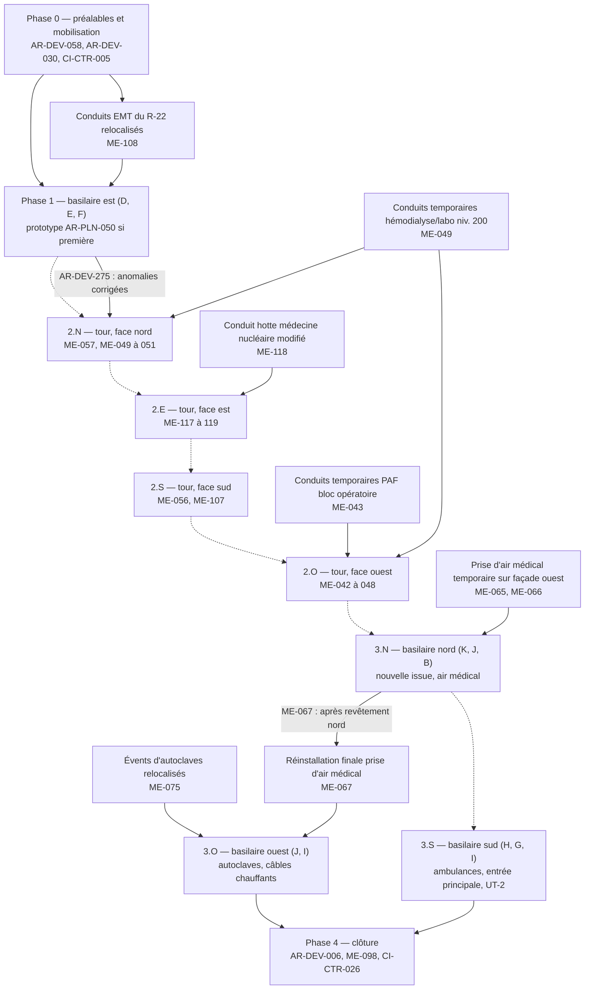
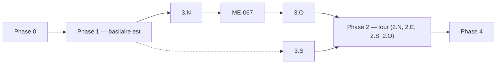
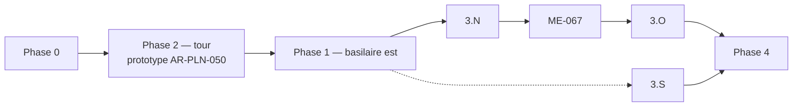
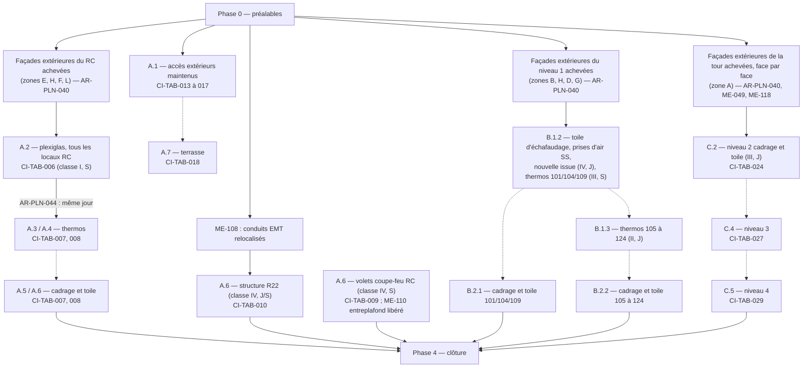

# 03 — Plan de phasage proposé

**Projet** : Hôpital de Chandler — Réfection de l'enveloppe (dossier GLCRM R-657-24 ; appel d'offres AOC-077221 ; CISSS de la Gaspésie).
**Documents amont** : `analyse/01-inventaire.md` (inventaire D1 à D11) et `analyse/02-contraintes.md` (registre de 719 contraintes, contradictions C-01 à C-40, zones d'ombre Z-01 à Z-28, renvois R-01 à R-40).
**Statut** : proposition d'analyse. Le phasage détaillé relève contractuellement de l'entrepreneur général (C-13 ; AR-DEV-013, AR-DEV-052) et les calendriers ne lient ni le CISSSGA ni les professionnels (AR-DEV-047). Aucune durée n'est proposée ici : l'échéancier de l'entrepreneur n'est pas fourni et les mentions « ±5 / ±8 / ±4 mois » du plan clé (D2 feuille 010) sont rapportées comme indications des architectes, non reprises comme durées (C-34).

---

## 0. Méthode et conventions

### 0.1 Deux découpages, produits tous les deux

Le dépôt contient deux logiques de phasage non reliées entre elles (C-34, C-35, Z-02) :

| Découpage | Source | Logique | Unités |
|---|---|---|---|
| **A — par secteurs** | D2 feuille 010 (plan clé) et 011 (élévations) | Phases par partie de bâtiment : basilaire est (phase 1), tour (phase 2), basilaires nord, ouest et sud (phase 3) ; archives (zone C) et oncologie 2023 (zone L) « secteur non touché par les travaux » | Zones A à L de la légende de la feuille 010 |
| **B — par niveaux** | D11 tableau des contraintes opérationnelles v3 (CISSS) | Une seule « phase 1 », sous-phases A.x (rez-de-chaussée), B.x (niveau 1 et sous-sol), C.x (niveaux 2 à 4) ; étapes de fenêtres nommées « plexiglass », « thermos », « cadrage et toile » | Sous-phases A.1 à A.7, B.1.2, B.1.3, B.2.1, B.2.2, C.2, C.4, C.5 (C.1, C.3, B.1.1 absents) |

Les deux sont développés (§2 et §3), avec un cadre commun (§1 : phase 0, contraintes transversales, phase 4, étapes types d'une façade). Leurs incompatibilités sont exposées en §4 (conflit K1).

### 0.2 Codes de phase utilisés

| Code | Découpage A | Code | Découpage B |
|---|---|---|---|
| 0 | Préalables et mobilisation (avant tout travail sur l'enveloppe) | 0 | idem |
| 1 | Basilaire est — zones D, E, F | A | Rez-de-chaussée — sous-phases A.1 à A.7 |
| 2 ; 2.N, 2.E, 2.S, 2.O | Tour — zone A ; sous-phases par face nord, est, sud, ouest | B | Niveau 1 et sous-sol — B.1.2, B.1.3, B.2.1, B.2.2 |
| 3 ; 3.N, 3.O, 3.S | Basilaires nord, ouest, sud — zones B, J, K, I, H, G ; sous-phases par façade | C | Tour, niveaux 2 à 4 — C.2, C.4, C.5 |
| 4 | Clôture : mise en service, essais intégrés, nettoyage final, réception | 4 | idem |
| T | Transversal : exigence continue pendant toutes les phases de travaux | T | idem |
| NA | Phase non déterminable d'après le texte des documents (§6) | NA | idem |

### 0.3 Règles de rédaction

1. **Traçabilité.** Chaque exigence est désignée par son identifiant du registre (AR-DEV-, AR-PLN-, ME-, ST-, CI-TAB-, CI-PCI-, CI-CTR-). Les contradictions, zones d'ombre et renvois sont cités par leurs codes C-, Z-, R-. Aucune contrainte n'est ajoutée au registre ici.
2. **Marquage des interprétations.** `[lecture]` : lecture graphique d'un plan (couleurs, repères) sans phrase correspondante ; `[choix]` : décision d'ordonnancement non imposée par un texte, assortie de variantes ; `[à confirmer]` : localisation ou portée que les documents ne fixent pas.
3. **Affectation ID → phase.** Chaque ID reçoit une ou plusieurs phases dans les deux découpages selon des règles écrites (zones A à L du tableau CISSS, niveaux, façades nommées dans le texte, mots-clés « avant le début », « fin des travaux »). Règle par défaut : T. L'annexe A donne les listes complètes par phase ; l'affectation individuelle est reprise dans `analyse/04-verification.md`.
4. **Zéro durée.** Aucune durée, aucun jalon daté. Seules les dates contractuelles écrites sont rappelées (CI-CTR-001 : 31 août 2026 – 31 décembre 2027).
5. **Confidentialité.** Aucun nom de personne ni coordonnée n'est reproduit.

### 0.4 Séquences écrites qui structurent tout le phasage

Ces passages sont les seuls textes du dépôt qui imposent un ordre. Tout le reste du séquençage proposé est `[choix]` ou `[lecture]`.

| Séquence imposée | ID | Portée |
|---|---|---|
| Travaux préparatoires et temporaires des systèmes existants **avant** la démolition ; construction d'une nouvelle issue et protection des issues ; jalons de début et fin de **chaque phase** | AR-DEV-058 | Toutes phases |
| Piquages et raccordements sur les réseaux existants **avant le début** des travaux | AR-DEV-030 | Phase 0 |
| Démolition (plans d'architecture) → relevé complet des façades → coordination de l'alignement → fabrication | ST-030 | Chaque façade |
| Point d'arrêt après retrait des revêtements ; point d'arrêt sur la structure d'acier avant recouvrement (préavis 24 h) | ST-011, ST-018 | Chaque façade |
| Fenêtres existantes maintenues **jusqu'à la fin des travaux par l'extérieur** ; plexiglas scellé **dès le retrait** de la fenêtre ; bâti isolé au lieu du plexiglas **de novembre à avril** ; thermos et finition **le même jour** que le retrait du plexiglas | AR-PLN-040 à 044 | Chaque fenêtre remplacée |
| Tour : 2 étapes (extérieur puis intérieur) ; basilaire RDC blocs de béton hors IRM : 3 étapes ; colombages IRM et niveau 100 : 2 étapes ; fenêtres repérées ④ exclues | AR-PLN-046 à 049 | Fenêtres |
| Prototype (première fenêtre, premier mur-rideau) en présence de l'architecte ; essais in situ en cours de travaux | AR-PLN-050, AR-PLN-051 | Première phase de fenêtres exécutée |
| Prise d'air du bloc opératoire : conduits temporaires **avant** démantèlement ; nouveau conduit **après** la fin du revêtement ; temporaires maintenus jusqu'à mise en service | ME-042 à 045 | Façade ouest |
| Hémodialyse / laboratoire niveau 200 : conduits temporaires **avant** la démolition de l'enveloppe ; coupures d'une journée, un conduit à la fois, **le dimanche, hors période estivale** | ME-049 à 051 | Façades nord/ouest de la tour |
| Air médical : prise temporaire **sur la façade ouest pendant** les travaux de la façade nord ; réinstallation finale **après** le revêtement de la façade nord | ME-065 à 067 | Façades nord et ouest (basilaire nord-ouest) |
| Évents d'autoclaves relocalisés **avant le début** des travaux de la façade ouest ; fenêtre « nuit ou le matin avant 10 h » | ME-075, ME-077 | Façade ouest |
| Conduit de la hotte de médecine nucléaire modifié **sur toute la hauteur** pour permettre les façades ; arrêt court du vendredi au dimanche | ME-118, ME-119 | Tour est |
| Séquence de fin de travaux PCI : fermeture des plafonds → nettoyage → HEPA → diffuseurs ; démantèlement des enceintes seulement après approbation | AR-DEV-243, AR-DEV-245 ; CI-PCI-023 | Fin de chaque zone intérieure |
| Correction des anomalies après chaque phase **avant** la phase suivante | AR-DEV-275 | Entre phases |
| Passage des installations temporaires de sécurité aux installations permanentes interdit **avant l'achèvement substantiel** | AR-DEV-170 | Phase 4 |

---

## 1. Cadre commun aux deux découpages

### 1.1 Phase 0 — Préalables et mobilisation

**Portée.** Tout ce qui doit exister avant le premier travail sur l'enveloppe : livrables administratifs, calendriers, plans de sécurité et PCI, installations de chantier, contournements électromécaniques identifiés « avant d'entreprendre la démolition » (AR-DEV-058), prototype non compris (il appartient à la première phase de fenêtres, AR-PLN-050).

**Zones.** Site (accès depuis le 451, rue Monseigneur-Ross Est, AR-DEV-134 ; zone clôturée, roulottes, voies, AR-DEV-171 ; bureau de chantier hors enceinte, possiblement dans le stationnement étagé, AR-DEV-180) ; aucun local hospitalier.

**Préalables.** Autorisation de débuter émise après assurances et garanties (CI-CTR-005) ; première réunion convoquée par l'organisme public (CI-CTR-015) ; réunion d'ordonnancement au plus tard 10 jours ouvrables après l'attribution (AR-DEV-050).

**Contraintes du registre traitées en phase 0** (112 IDs, dont plusieurs se prolongent en T ; liste intégrale en annexe A) :

| Groupe | IDs | Contenu |
|---|---|---|
| Contrat et échéancier | CI-CTR-001, CI-CTR-003 à 005, CI-CTR-008, CI-CTR-015, CI-CTR-022, CI-CTR-023 | Dates contractuelles ; échéancier exposant phasage, phases d'acceptation, chemin critique ; programme de prévention ; avis CNESST ; sites de déchets déclarés |
| Calendriers et jalons | AR-DEV-008, AR-DEV-014, AR-DEV-026, AR-DEV-032, AR-DEV-048 à 053, AR-DEV-056 à 060, AR-DEV-125, AR-DEV-286 ; ME-129 ; ST-012, ST-020 | Cinq calendriers ; Gantt ≤ 5 jours ouvrables après attribution ; calendrier d'exécution ≤ 10 jours après acceptation du plan d'ensemble ; date d'achèvement par phasage ≤ 10 jours après octroi ; jalons obligatoires ; calendrier électricité ≤ 15 jours ouvrables ; échéancier au conseiller en structure |
| Documents de référence à consulter | AR-DEV-001, AR-DEV-002, AR-DEV-048, AR-DEV-049 ; AR-PLN-022 à 024 ; ME-001 à 005, ME-160 ; ST-001, ST-002, ST-004, ST-005 | Tableau de coordination WSP (D5) — séquençage électromécanique à y lire (AR-PLN-022), tableau des contraintes du CISSS (D11), divergences signalées et conditions existantes vérifiées avant exécution (AR-PLN-023, 024), plans « émis pour construction » requis (ST-005, ME-160 : les plans du dépôt sont « pour soumission ») |
| Sécurité, SST, urgence | AR-DEV-021, AR-DEV-022, AR-DEV-035, AR-DEV-038, AR-DEV-069 à 072, AR-DEV-076, AR-DEV-079, AR-DEV-095, AR-DEV-166, AR-DEV-197, AR-DEV-200, AR-DEV-284 | Liste des employés 2 jours avant ; réunion SST ; plan de sécurité du site ; programme de prévention 10 jours avant ; plan d'intervention d'urgence arrimé à l'évacuation du site ; procédures travaux à risque ; plan détaillé de l'ordre de démontage et d'étaiement avant d'entreprendre ; attestation de l'agent de sécurité avant le début, présence continue ensuite ; plan de sécurité incendie approuvé par le CISSSGA, l'Établissement et le service incendie **avant** le démarrage ; mesures supplétives RBQ le cas échéant |
| PCI et QAI | AR-DEV-115, AR-DEV-117, AR-DEV-124, AR-DEV-147, AR-DEV-148, AR-DEV-202, AR-DEV-203, AR-DEV-214 ; CI-PCI-001 à 003, CI-PCI-005 | Plan QAI ≤ 10 jours après octroi ; plans des cloisons temporaires et compartimentation ; plan anti-poussière indiquant les cloisons **pour chaque phase** ; approbation de la méthodologie PCI ; certification des unités HEPA < 12 mois avant démarrage dans les zones du groupe 4 ; classification de chaque intervention, fiche synthèse (classes III et IV), équipe pluridisciplinaire |
| Bruit et vibrations | AR-DEV-130, AR-DEV-131 | Sonomètres classe 1 et capteurs de vibration installés **avant le début** (chambres, salles d'opération, structure) ; seuils à établir avec le CISSSGA (Z-04) |
| Accès, circulation, site | AR-DEV-025, AR-DEV-028, AR-DEV-029, AR-DEV-134, AR-DEV-135, AR-DEV-141, AR-DEV-171, AR-DEV-172, AR-DEV-180, AR-DEV-181, AR-DEV-183, AR-DEV-189 à 191 ; AR-PLN-002, AR-PLN-003, AR-PLN-005, AR-PLN-015 ; ST-040 | Accès des véhicules depuis le 451, rue Monseigneur-Ross Est (régimes d'accès divergents : C-10) ; itinéraires de rechange, moyens d'accès temporaires et séparation des accès chantier / hôpital mis en place dès le départ ; rencontre avec la Ville ; mesures d'accès validées par le CISSSGA, les professionnels et la ville ; échafaudages choisis selon l'usage du bâtiment **et le phasage** ; palissade 1,8 m, barrières verrouillables **selon les phasages**, passages abrités ; roulotte ≤ 30 jours ; panneau ≤ 3 semaines ; débarcadère et piste cyclable coordonnés ; utilités publiques localisées |
| Structure et échafaudages | AR-DEV-086 ; ST-007, ST-008, ST-014, ST-023, ST-025 | Séquence et travaux temporaires établis par l'entrepreneur ; plans de démolition et d'étaiement scellés ; attestation d'échafaudage respectant les capacités des toitures et la neige ; aucune fabrication avant retour des dessins d'atelier |
| Réseaux existants | AR-DEV-030 ; ME-130 à 132, ME-152, ME-153 | Piquages et raccordements **avant le début** ; liste de matériel ≤ 10 jours ; lettre de vérification de l'ingénieur avant d'entreprendre ; approbation des plans de gicleurs par l'ingénieur et l'architecte |
| Mise en service et déchets | AR-DEV-256, AR-DEV-259, AR-DEV-262, AR-DEV-263, AR-DEV-267, AR-DEV-269, AR-DEV-270, AR-DEV-272, AR-DEV-297 | Agent de mise en service ≤ 4 semaines ; examen préalable des dispositions de mise en service ; plan de gestion des déchets et centre de tri avant démarrage ; prélèvement des éléments à récupérer par le propriétaire |

**Mesures transitoires de phase 0.** Clôture et palissade avec toile anti-poussière (AR-DEV-189), barrières selon les phasages (AR-DEV-190), passages abrités pour piétons (AR-DEV-191), itinéraires de rechange (AR-DEV-025), signalisation aux barrières (AR-DEV-137), séparation des accès chantier et hospitaliers (AR-DEV-029), services temporaires pour les systèmes critiques (AR-DEV-027), piquages sur les réseaux (AR-DEV-030). Les contournements électromécaniques propres à une façade (conduits temporaires, prises d'air provisoires) sont rattachés à la sous-phase qui les exige (§2, §3), avec la règle AR-DEV-058 : exécutés **avant** la démolition de la façade concernée.

**Points de validation CISSS.** Approbation du calendrier d'exécution et du calendrier d'arrêt des installations (AR-DEV-026, AR-DEV-032, AR-DEV-286) ; approbation du plan de sécurité incendie (AR-DEV-197) ; approbation de la méthodologie PCI et des cloisons (AR-DEV-203, CI-PCI-003) ; validation des mesures d'accès (AR-DEV-141) ; approbation de l'emplacement des voies de chantier (AR-DEV-187) ; confirmation par le chargé de projet de l'ascenseur no 1 et de l'escalier à utiliser (CI-TAB-002) ; convocation de l'équipe pluridisciplinaire PCI pour les classes III et IV (CI-PCI-005) ; première réunion de chantier (CI-CTR-015).

### 1.2 Contraintes transversales (T)

Ces exigences valent pendant toutes les phases de travaux et ne sont pas répétées dans chaque fiche de phase ; chaque fiche renvoie au présent tableau. Regroupement par section source (498 IDs dans le découpage A ; liste intégrale en annexe A).

| Thème | Source | IDs | Modalité dans chaque phase |
|---|---|---|---|
| Conditions administratives et exécution | D1 00 08 00 ; 01 11 00 | AR-DEV-003 à 005, AR-DEV-007, AR-DEV-009 à 020, AR-DEV-023 à 025, AR-DEV-027 | Exécution sans interruption pendant arbitrage ; nettoyage en fin de quart ; protections temporaires du pourtour ; aucune fermeture de rue ; site accessible en tout temps aux usagers ; double approbation avant percement ; préavis 48 h avant interruption de services |
| Sécurité du site, escortes, bruit | D1 01 14 00 | AR-DEV-028, AR-DEV-029, AR-DEV-031 à 034, AR-DEV-036, AR-DEV-037, AR-DEV-039 à 045 | Accès distincts chantier / hôpital ; commissionnaires (1 pour 5 travailleurs) dans les secteurs avec services hospitaliers ; travaux bruyants en soirée avec agent de contrôle du bruit ; livraisons entre 9 h et 15 h ; accès par l'entrée principale sauf approbation (C-10) |
| Ordonnancement en continu | D1 01 32 16.19 ; 01 33 00 | AR-DEV-046, AR-DEV-047, AR-DEV-049, AR-DEV-054, AR-DEV-055, AR-DEV-061 à 065 | Mise à jour mensuelle ; calendrier hebdomadaire le jeudi AM indiquant les coupures ; aucun travail avant la fin de l'examen des pièces soumises |
| SST : cadenassage, travail à chaud, levage, espaces clos, échafaudages, toitures | D1 01 35 29 | AR-DEV-073 à 075, AR-DEV-077 à 094, AR-DEV-096 à 113 | Fiche de cadenassage 48 h avant ; permis de travail à chaud par quart et par secteur, surveillance 1 h puis inspection 4 h ; plan de levage 5 jours avant, survol des zones occupées évité ; permis d'espace clos 5 jours avant ; toiles ignifuges laissant passer la lumière ; garde-corps de toiture jusqu'à la fin ; mesures CO/NOx aux 30 min |
| Qualité de l'air intérieur | D1 01 35 00 ; 01 35 46 | AR-DEV-066, AR-DEV-067, AR-DEV-114, AR-DEV-116, AR-DEV-118 à 123, AR-DEV-126, AR-DEV-127 | HEPA obligatoire ; CVCA permanent non utilisé pendant la construction ; conduits scellés en fin de journée ; dépressurisation ; activités QAI isolées au calendrier (hors heures) ; arrêt sur avis de non-conformité |
| Bruit, vibrations, inspections | D1 01 41 00 ; 01 45 00 | AR-DEV-128 à 133 | Arrêt immédiat si amiante, PCB ou moisissures ; enregistrement continu ; inspection des travaux antérieurs avant les siens |
| Installations et circulation de chantier | D1 01 51 00 ; 01 52 00 | AR-DEV-134, AR-DEV-136 à 140, AR-DEV-142 à 146, AR-DEV-149 à 169, AR-DEV-173 à 179, AR-DEV-182, AR-DEV-184 à 188 | Voies jamais obstruées ; préavis 3 semaines pour déplacer une voie ; transports hors norme avant 7 h ; 10 °C dans les zones de travaux ; corridors protégés type conteneur ; supports temporaires selon le phasage (AR-DEV-155) ; autorisation 48 h avant grue ; ascenseurs sur approbation ; surveillance hors heures ; déneigement |
| Protection incendie temporaire et séparations | D1 01 56 00 | AR-DEV-190, AR-DEV-192 à 196, AR-DEV-198, AR-DEV-199 | Écrans pare-poussière déplacés au besoin ; aucune non-conformité induite dans les secteurs occupés (corridors 1650 / 2400 mm) ; séparation coupe-feu 1 h continue jusqu'à la dalle |
| PCI (prescriptions de l'architecte) | D1 01 56 50 | AR-DEV-201, AR-DEV-203 à 245 | Approbation de la préparation des lieux avant de débuter ; Tyvek ; itinéraire intérieur approuvé ; scellement des grilles avant le début ; 7,5 Pa / 2,5 Pa ; tapis collants ; CFT dalle à dalle 1 h ; SAS ; nettoyage quotidien ; cheminement des rebuts établi par le propriétaire **pour chaque étape/phase** (AR-DEV-240) ; séquence de fin de travaux |
| Ouvrages existants, percements, nettoyage, déchets | D1 01 61 00 ; 01 73 00 ; 01 74 00 ; 01 74 19 ; 01 74 21 ; 01 78 00 ; 01 91 13 | AR-DEV-246 à 254, AR-DEV-258 à 261, AR-DEV-264, AR-DEV-266, AR-DEV-273, AR-DEV-275 | Demande écrite avant tout découpage ; obturation coupe-feu des traversées ; nettoyage quotidien des aires occupées ; consignation avant dissimulation ; correction des anomalies après chaque phase |
| Démolition et matières dangereuses | D1 02 41 19.13 ; 02 81 00 | AR-DEV-278 à 296, AR-DEV-299 à 302 | Arrêt si amiante ; enceintes de démolition ; dynamitage interdit ; canalisations en service jamais coupées ; ouvrage stable en fin de journée ; 45 L max de liquides inflammables |
| Enveloppe : maçonnerie, acier, escaliers, isolants, pare-air, couverture, solins, coupe-feu, scellants, volets, murs-rideaux, vitrages | D1 04 05 00 à 08 80 00 | AR-DEV-303 à 312, AR-DEV-314 à 344 | Seuils de température (Z-10) ; échantillons et visites du fabricant à 0/25/60/100 % ; essais d'étanchéité in situ ; 72 h avant de dissimuler les coupe-feu ; détail d'assemblage avec la fenêtre existante |
| Finitions intérieures et site | D1 09 21 16 ; 09 91 00 ; 06 40 00 ; 12 24 00 ; 32 31 13 | AR-DEV-313, AR-DEV-345 à 351, AR-DEV-353 | Peinture : 10 °C 24 h avant, 323 lux ; toiles solaires mesurées sur place ; clôtures sans coupe au chantier |
| Plans d'architecture : issues, site, notes générales | D2 001, 002, 005 | AR-PLN-016, AR-PLN-017, AR-PLN-020, AR-PLN-025 à 036, AR-PLN-074, AR-PLN-082 | Issues et chemins d'évacuation maintenus (1650 mm) ; portes hors service repérées ; plan d'action avant tout travail près d'une issue ; amiante ; coupe-feu ; parures de fenêtres ; voies protégées sur les toitures ; briques récupérées |
| Plans d'architecture : fenêtres, toitures, entretoits, plafonds | D2 050-054, 100-104, 301, 302, 402, 452, 502, 505, 601-607, 701-704 | AR-PLN-001, AR-PLN-006, AR-PLN-007, AR-PLN-011, AR-PLN-012, AR-PLN-037 à 045, AR-PLN-049, AR-PLN-052 à 055, AR-PLN-059 à 063, AR-PLN-065 à 070, AR-PLN-073, AR-PLN-075 à 078, AR-PLN-080, AR-PLN-081 | Séquence des fenêtres (§0.4) ; compartimentation des entretoits et de l'enveloppe ; plafonds suspendus démontés et remis ; échelles et unités de toiture démontées ; persiennes entreposées |
| Électromécanique : prescriptions générales | D3 20 00 01 ; 26 05 00 ; 21 00 01 ; 23 33 16 ; 25 00 01 ; D4 G001, G002 | ME-001 à 005, ME-011 à 024, ME-026 à 028, ME-030, ME-032 à 041, ME-098, ME-124 à 140, ME-148 à 161 | Percements hors heures d'occupation ; détection avant percement ; aucune dissimulation sans inspection ; entrebarrages ; tuiles acoustiques par l'entrepreneur général ; levage planifié avec propriétaire et municipalité ; entreposage interdit sauf autorisation ; protection contre la poussière |
| Électromécanique : systèmes maintenus partout | D4 ME001, ME005, ME013 ; D3 26 50 00 | ME-063, ME-089, ME-092 à 094, ME-100 à 106 | Pré-filtres sur les persiennes non touchées ; alarme incendie fonctionnelle en tout temps ; paratonnerre ; lecteurs de carte et luminaires démontés puis réinstallés |
| Structure : notes générales et d'élévation | D6 S002, S101, S102, S201-S204, S303, S411 | ST-003, ST-006, ST-009 à 011, ST-013, ST-015 à 030, ST-033 à 036, ST-038 | Aucun percement sans permission ; fenêtres non fixées aux colombages ; points d'arrêt ; charges plafonnées ; toitures non surchargées ; séquence démolition → relevé → fabrication ; renforts HSS en 3 étapes ; béton ≥ 10 °C |
| Tableau CISSS et procédure PCI | D11 ; D10 | CI-TAB-001 à 004, CI-TAB-030 ; CI-PCI-001 à 026 | Délai de 2 jours ouvrables par activité classée ; ascenseur no 1 et escalier le plus près ; accès par l'extérieur priorisés ; toile sur les échafaudages jusqu'aux membranes ; pression négative 24/7 ; SAS ; entretien quotidien ; pouvoir d'interruption du service PCI |
| Contrat | D8 | CI-CTR-002, CI-CTR-004, CI-CTR-006, CI-CTR-007, CI-CTR-009 à 014, CI-CTR-016 à 021, CI-CTR-023 à 025, CI-CTR-027 | Prolongation demandée dans les 15 jours ; prévention des infections ; bruits excessifs ; percements annoncés ; surintendant en continu ; propreté ; matières dangereuses ; primauté des documents |

### 1.3 Étapes types d'une sous-phase de façade

Enchaînement interne applicable à chaque façade ou face, dérivé des seules séquences écrites (§0.4). Il sert de gabarit aux fiches des §2 et §3 ; il ne fixe aucune durée.

| Étape | Contenu | Sources |
|---|---|---|
| E1 — Préparation | Classification PCI de l'intervention et fiche synthèse (classes III-IV) ; délai de 2 jours ouvrables de déménagement ou d'activation ; retrait ou protection du matériel médical ; relocalisation des patients à haut risque si requis ; cloisons CFT/CET, SAS, pression négative, scellement des grilles ; approbation de la préparation des lieux ; toile sur l'échafaudage ; contournements électromécaniques de la façade (**avant** démolition) ; plan d'action pour les issues touchées | CI-PCI-001, 002, 025, 026 ; CI-TAB-001 ; AR-DEV-204, 212, 213, 229 à 234 ; CI-TAB-004 ; AR-DEV-058 ; AR-PLN-011 |
| E2 — Démolition de l'enveloppe | Retrait des revêtements, persiennes entreposées, équipements muraux démontés ; fenêtres existantes **maintenues** ; débris évacués en fin de journée hors grand achalandage ; arrêt si amiante | AR-PLN-078, AR-PLN-040, ME-104 ; AR-DEV-238, 129 ; AR-PLN-025 |
| E3 — Relevé et structure | Point d'arrêt après retrait des revêtements ; relevé complet ; validation des dimensions **avant fabrication** ; localisation des armatures ; renforts et réparations de béton (≥ 10 °C) ; point d'arrêt acier avant recouvrement (24 h) | ST-011, ST-030, ST-027, ST-028, ST-034, ST-018 |
| E4 — Enveloppe neuve | Pare-air (réunion préalable, seuils thermiques), compartimentation, isolant, revêtement, solins, couverture des bandes de toiture démolies ; essais in situ | AR-DEV-315 à 319, 320 à 329 ; AR-PLN-063, 065, 066 ; AR-PLN-051 |
| E5 — Fenêtres | Retrait de la fenêtre existante seulement « jusqu'à ce que les travaux par l'extérieur soient complétés » (AR-PLN-040) — `[lecture]` : E5 est placée après E4 en assimilant « travaux par l'extérieur » à la réfection complète de la façade ; lecture alternative non tranchée par les documents : « travaux par l'extérieur » désigne l'étape extérieure de chaque fenêtre (AR-PLN-046 à 048 : « étape no 1 : travaux par l'extérieur »), et AR-PLN-042 exige le bâti isolé « pour la durée des travaux à effectuer par l'extérieur », donc des travaux extérieurs pendant la période plexiglas (C-36, Z-07) ; plexiglas (ou bâti isolé de novembre à avril) ; thermos et finition le même jour que le retrait du plexiglas ; étapes CISSS « plexiglass / thermos / cadrage et toile » avec leur classe PCI et leur horaire | AR-PLN-040 à 048 ; CI-TAB-006 à 008, 020, 021, 024, 027, 029 |
| E6 — Remise en service et fin de zone | Réinstallation des équipements (luminaires, lecteurs, persiennes repeintes, prises d'air) ; essais et préavis ; séquence PCI de fin de travaux ; désinfection terminale par l'hygiène et salubrité ; démantèlement des enceintes après approbation ; correction des anomalies avant la phase suivante | ME-105, AR-PLN-031, ME-067, ME-076 ; ME-013 à 018 ; AR-DEV-243 à 245 ; CI-PCI-023, 024 ; AR-DEV-275 |

### 1.4 Phase 4 — Clôture

**Portée.** Après la dernière sous-phase de façade : essais intégrés CAN/ULC-S1001 (AR-DEV-006 ; ME-098), équilibrage aéraulique et hydronique (ME-134 à 138), remplacement des filtres juste avant la réception provisoire (ME-139), MERV 13 avant occupation (AR-DEV-114), mise en service avec préavis 21 et 14 jours (AR-DEV-274, AR-DEV-276), demandes de changement approuvées 8 semaines avant (AR-DEV-271), réunion de portée à 60 % d'avancement (AR-DEV-273), certificat de réception provisoire subordonné aux documents de mise en service (AR-DEV-268), essais par l'agent de validation du CISSSGA en fin de travaux (AR-DEV-068), inspection provisoire avec démonstration des systèmes (ME-140), équipements sensibles aux saisons mis en service **avant** le certificat (AR-DEV-277), vérification complète de l'alarme incendie et certificat (ME-094), certification de l'air médical (ME-069 à 073), manuels 2 semaines avant la réception avec réserves (AR-DEV-265), documents de gestion des déchets (AR-DEV-257), nettoyage final et contrôle de la qualité de l'air avant réouverture (AR-DEV-243 à 245, AR-DEV-255 ; CI-PCI-023, 024), garde-corps de toiture démantelés sur autorisation (AR-DEV-100), remise en état des surfaces, plantations, clôtures et barbelé (AR-DEV-298, AR-DEV-352 ; AR-PLN-004, 074), avis de fermeture de chantier (CI-CTR-022), réception avec inspection dans les 10 jours ouvrables et prise de possession anticipée possible par partie (CI-CTR-026).

**Préalables.** Toutes les phases de façade terminées et leurs anomalies corrigées (AR-DEV-275) ; installations temporaires de sécurité maintenues jusqu'à l'achèvement substantiel (AR-DEV-170).

**Note.** Plusieurs de ces éléments se répètent à la fin de chaque phase pour les systèmes remis en service (ME-013 à 019 ; ME-033 à 035) et à la fin de chaque zone intérieure (AR-DEV-243 à 245) ; ils portent le double code T,4.

**Points de validation CISSS.** Approbation du nettoyage par le chef de projet et l'équipe PCI avant démantèlement des enceintes (AR-DEV-245) ; désinfection terminale par l'hygiène et salubrité (CI-PCI-023) ; contrôle de la qualité de l'air avant réouverture d'un service (CI-PCI-024) ; mise en service finale sous supervision des représentants du propriétaire (ME-035) ; préavis d'une semaine au propriétaire avant mise en route électrique (ME-017) ; formation du personnel (ME-019) ; réception (CI-CTR-026).

---

## 2. Découpage A — par secteurs du plan clé (D2 feuille 010)

### 2.1 Vue d'ensemble

| Phase | Secteur du plan clé `[lecture]` (C-35) | Zones de la légende 010 | Contenu des zones (légende 010, texte) | Fenêtres (AR-PLN-046 à 048) |
|---|---|---|---|---|
| 1 | « Basilaire est (2 étages) » | D, E, F | D : administration niveau 100 et cliniques externes RC ; E : oncologie 1974 ; F : IRM | RC blocs de béton : 3 étapes ; IRM et niveau 100 (colombages) : 2 étapes |
| 2 | « Tour (4 étages) » | A | A : tour des chambres, niveaux 200 à 400 | 2 étapes (extérieur puis intérieur) |
| 3 | « Basilaire nord », « basilaire ouest (1 étage) », « basilaire sud (2 étages) » | B, J, K, I, H, G | B : laboratoire niveau 100 ; J : basilaire nord-ouest ; K : basilaire nord-est ; I : basilaire sud-ouest ; H : chirurgie d'un jour niveau 100 et urgence RC ; G : basilaire sud-est | RC blocs : 3 étapes ; niveau 100 : 2 étapes |
| Hors travaux | « Secteur non touché par les travaux » | C, L | C : archives RC ; L : oncologie 2023 | — (mais voir C-40 pour R-22 et §4 K6 pour la zone L) |

La correspondance phase ↔ zones est une lecture des couleurs du plan clé ; aucune phrase « phase X = zones … » n'existe (C-35). L'ordre 1 → 2 → 3 n'est écrit nulle part (Z-23) ; il est retenu comme ordre de référence `[choix]` et les variantes sont en §2.7.

La correspondance zones A à L ↔ élévations A à I (feuille 011) ↔ élévations du tableau WSP (D5) n'est pas écrite (Z-24) ; les sous-phases par face ci-dessous sont nommées par orientation (nord, est, sud, ouest), comme le font les notes des plans ME.

### 2.2 Phase 1 — Basilaire est (zones D, E, F)

**Zones.** D (administration niveau 100 ; cliniques externes RC), E (oncologie 1974), F (IRM) ; toitures du basilaire est ; entreplafonds du RC pour les volets coupe-feu et les renforts R-22.

**Portée.**
- Enveloppe des façades du basilaire est (deux niveaux : RC et niveau 100), bandes de toiture périmétriques (AR-PLN-063), compartimentation verticale (AR-PLN-065, 066).
- Fenêtres : RC blocs de béton hors IRM en 3 étapes (AR-PLN-047) ; IRM et niveau 100 en 2 étapes (AR-PLN-048) ; fenêtres repérées ④ exclues du principe (AR-PLN-049 ; Z-26).
- Volets coupe-feu de fenêtre R16, R34, R36B1/2 : entreplafond libéré, gicleur et tuyauterie relocalisés, plafond démantelé partiellement (ME-010, ME-109, ME-110 ; AR-PLN-058 ; CI-TAB-009 classe IV, horaire « S »).
- Renforts des colonnes A4, A5, A6 dans l'entreplafond du local R-22, que ME-108 situe au « Secteur IRM » (ME-111 ; conduits EMT relocalisés **avant**, ME-108) ; classe IV, horaire « J/S » (CI-TAB-010). Le tableau CISSS place le local R-22 en zone C (archives), que le plan clé déclare non touchée, et Z-25 le situe entre l'urgence et la radiologie : conflit C-40, traité en §4 (K6).
- Équipements de façade est : bi-bloc LG 18 MBH (ME-086), bi-bloc de la salle des serveurs RC (ME-088 : arrêt de courte durée, semaine, hors période estivale), capotin de la hotte de la salle communautaire (ME-142, niveau non écrit), bi-blocs conservés avec revêtement autour de la tuyauterie (ME-144).
- Stationnement de l'IRM mobile au coin nord-est : sorties d'arrosage conservées, alcôve dans le nouveau revêtement (ME-116 ; CI-TAB-017 zones E/F/L).
- Prototype de la première fenêtre et du premier mur-rideau en présence de l'architecte (AR-PLN-050) et essais in situ (AR-PLN-051), **si la phase 1 est la première exécutée** (§2.7).

**Préalables.** Phase 0 complète (§1.1). Propres à la phase : conduits EMT du R-22 relocalisés avant les travaux structuraux (ME-108) ; entreplafond IRM libéré avant les volets (ME-110) ; coordination de service de la porte IRM (AR-PLN-010) ; interdiction de métal quand l'IRM est en service (AR-PLN-009) ; gestion de la zone IRM et de l'unité mobile (AR-PLN-021 ; CI-TAB-017) ; conduit de la hotte de médecine nucléaire modifié « sur toute la hauteur » si la façade est du basilaire porte ce conduit (ME-118 ; localisation « tour est », donc d'abord rattaché à 2.E — `[à confirmer]`).

**Contraintes du registre spécifiques à la phase 1** (36 IDs ; plus les transversales du §1.2) :
AR-PLN-009, AR-PLN-010, AR-PLN-021, AR-PLN-047, AR-PLN-048, AR-PLN-050, AR-PLN-051, AR-PLN-057, AR-PLN-058, AR-PLN-072 ; ME-010, ME-086, ME-088, ME-097, ME-108 à 112, ME-116, ME-142, ME-144 ; ST-031, ST-032 ; CI-TAB-006 à 012, CI-TAB-015, CI-TAB-017, CI-TAB-020, CI-TAB-021, CI-TAB-026.

**Classes PCI et horaires écrits au tableau CISSS** (repris tels quels ; régime PCI incertain, C-01, C-02, Z-05) : plexiglas tous les locaux RC zones E/H : classe I, horaire « S », Tyvek et couvre-chaussures (CI-TAB-006) ; thermos et cadrage RC secteurs R04/R07/R10/R16/R46 : classe III, « S » (CI-TAB-007) ; secteurs R33/R34/R36/R44 : classe II, « S », Tyvek, couvre-chaussures, SAS plastique (CI-TAB-008 ; C-03) ; volets coupe-feu : classe IV, « S » (CI-TAB-009) ; structure R22 : classe IV, « J/S » (CI-TAB-010) ; fenêtres niveau 1 secteurs 101/104/109 zones B/H/D : classe III, « S » (CI-TAB-020) ; secteurs 105 à 124 zones D/G : classe II, « J » (CI-TAB-021) ; délai de 2 jours ouvrables pour chacune (CI-TAB-001). Signification de « J » et « S » non définie (Z-01).

**Mesures transitoires.**
- Cloisons CFT dalle à dalle 1 h avec SAS pour chaque local touché (AR-DEV-229 à 233), CET sur les cloisons existantes (AR-DEV-234), CTM/CST seulement pour les interventions très courtes en plafond (AR-DEV-227, 228) ; pression négative 7,5 / 2,5 Pa (AR-DEV-213 ; CI-PCI-015).
- Plexiglas scellé dès le retrait de chaque fenêtre, ou bâti isolé de novembre à avril (AR-PLN-041, 042).
- Bi-bloc de la salle des serveurs : arrêt de courte durée en semaine hors été (ME-088) ; bi-bloc LG : récupération du réfrigérant et remise en marche pour maintien en opération (ME-086).
- Persienne de l'échangeur du secteur de la roulotte IRM mobile retirée temporairement et réinstallée après le revêtement (ME-143 ; localisation contradictoire, §6).
- Sorties d'arrosage protégées, plaque de finition retirée temporairement (ME-116).
- Tuiles de plafond retirées et remises, tuiles avec gicleur conservées (AR-PLN-059, 060, 076, 077 ; ME-039).
- Détecteur de fumée du secteur IRM conservé et protégé (ME-097) ; gicleur du local R-34 remplacé et descente relocalisée (ME-010) ; tuiles avec gicleur conservées et protégées (AR-PLN-060).

**Points de validation CISSS.** Coordination des travaux bruyants R16/R44/R46 et des vibrations R26/R29/R46 (CI-TAB-011, 012) ; horaire « S » des étapes de fenêtres et « J/S » du R22 (CI-TAB-006 à 010) ; coordination de la porte IRM et de la zone IRM avec l'établissement (AR-PLN-010, 021) ; approbation de la préparation des lieux avant chaque local (AR-DEV-204) ; calendrier des coupures (arrêt du bi-bloc des serveurs) approuvé et préavis 48 h (AR-DEV-024, 031, 032 ; ME-088) ; entrées des cliniques externes et de l'oncologie maintenues selon les documents d'architecture (CI-TAB-015 ; R-29) ; approbation du nettoyage avant démantèlement des enceintes (AR-DEV-245).

### 2.3 Phase 2 — Tour (zone A), sous-phases par face 2.N, 2.E, 2.S, 2.O

**Zones.** A (tour des chambres, niveaux 200 à 400) ; toiture de la tour ; sous-sol pour les prises d'air du service alimentaire, que le tableau CISSS rattache à la zone A (CI-TAB-005, D11 L5 à L7 `[tel qu'écrit]`).

**Portée commune aux quatre faces.** Enveloppe de la tour sur quatre niveaux ; fenêtres en 2 étapes (AR-PLN-046) ; étapes CISSS « cadrage et toile » niveaux 2, 3 et 4 en classe III, horaire « J » (CI-TAB-024, 027, 029) ; volets coupe-feu niveaux 200 à 400 (AR-PLN-057) ; plexiglas de protection à enlever au secteur psychiatrie, niveau 300 uniquement (AR-PLN-071) ; travaux bruyants et vibrations aux locaux 209/210/211/236-237 et 309 à 324 à coordonner (CI-TAB-025, 028 ; C-30) ; soins intensifs, chambre 315 : apport d'air frais supplémentaire maintenu (ME-058, face non écrite) ; échafaudage de quatre étages sur les toitures du basilaire : attestation scellée, capacités des toitures, toile (ST-023 à 026 ; CI-TAB-004 ; AR-DEV-172) ; prises d'air du service alimentaire au sous-sol, classe IV, horaire « S » (CI-TAB-005), registre motorisé relocalisé pour le registre coupe-feu (ME-029, ME-025).

**Ordre des faces.** Aucun texte n'impose l'ordre des quatre faces de la tour. Seules contraintes écrites : conduits temporaires de l'hémodialyse/laboratoire **avant** la démolition des façades nord et ouest du niveau 200 (ME-049) ; conduit de la hotte de médecine nucléaire modifié sur toute la hauteur avant la façade est (ME-118). Ordre de référence `[choix]` : 2.N → 2.E → 2.S → 2.O ; toute permutation respectant les deux règles ci-dessus est admissible.

#### 2.3.1 Sous-phase 2.N — face nord
- **Portée propre.** Chambre à pression négative 216 : prolongation temporaire du conduit d'évacuation hors des échafaudages (ME-057). Hémodialyse et laboratoire niveau 200 : unité de ventilation maintenue par conduits temporaires d'alimentation et de retour installés **avant** la démolition (ME-049) ; coupures d'une journée, un conduit à la fois, le dimanche, hors période estivale, selon l'horaire du propriétaire (ME-050, 051 ; R-21) ; point d'entrée en toiture conservé, étanchéité refaite en fin (ME-052) ; manchon selon G004 (ME-053) ; passerelle d'aluminium enlevée et modifiée (ME-054) ; bi-bloc de la salle de traitement d'eau 203 : arrêt court hors été (ME-087).
- **Préalables.** Conduits temporaires hémodialyse en place (ME-049) ; horaire des coupures convenu avec le propriétaire (ME-050) ; fenêtre hors période estivale (ME-051) : voir K3.
- **IDs.** ME-049 à 054, ME-057, ME-080, ME-096, ME-120 à 123 ; ST-037.
- **Mesures transitoires.** Conduits temporaires d'air frais (ME-049) ; conduit RAV prolongé (ME-057) ; supports temporaires calculés (AR-DEV-153).
- **Validation CISSS.** Horaire des coupures hémodialyse (ME-050, 051) ; occupation de la chambre 216 ; classe III « J » niveaux 2-4 (CI-TAB-024, 027, 029).

#### 2.3.2 Sous-phase 2.E — face est
- **Portée propre.** Conduit de la hotte de médecine nucléaire modifié sur toute la hauteur, supports temporaires, arrêt de courte durée du vendredi au dimanche (ME-118, 119) ; sorties d'évent relocalisées en toiture (ME-117) ; bi-bloc LG est et bi-blocs conservés (ME-086, 089, 144) ; capotin de la hotte de la salle communautaire (ME-142).
- **Préalables.** Coordination de l'arrêt de la hotte (vendredi–dimanche) ; le conduit modifié « sur toute la hauteur » précède les travaux de façade (ME-118).
- **IDs.** ME-086, ME-117 à 119, ME-142, ME-144.
- **Mesures transitoires.** Supports temporaires du conduit de hotte ; prolongation temporaire hors échafaudages du capotin (ME-142) ; bi-bloc : récupération du réfrigérant et remise en marche (ME-086).
- **Validation CISSS.** Fenêtre d'arrêt de la hotte de médecine nucléaire (ME-119) ; coupures 48 h (AR-DEV-024).

#### 2.3.3 Sous-phase 2.S — face sud
- **Portée propre.** Chambre à pression négative 307 : démantèlement seulement quand la chambre est inoccupée (ME-056) ; sectionneurs de thermopompes retirés temporairement, circuit fermé (ME-107).
- **Préalables.** Confirmation par l'établissement que la chambre 307 est inoccupée (ME-056).
- **IDs.** ME-056, ME-107 ; ST-037.
- **Validation CISSS.** Inoccupation de la chambre 307 (ME-056) ; classe III « J » (CI-TAB-024, 027, 029).

#### 2.3.4 Sous-phase 2.O — face ouest
- **Portée propre.** Prise d'air frais du bloc opératoire : « façade ouest (tour) » selon ME-045 ; maintenue en fonction par deux conduits temporaires 900 × 900 mm raccordés au plénum sous le soffite (ME-042, 047) ; étape temporaire 1 démantelée seulement après mise en place des conduits temporaires, étape 2 après le nouveau conduit secondaire (ME-043, 044) ; nouveau conduit installé après la fin du revêtement, temporaires maintenus jusqu'à la mise en service (ME-045) ; entrées principale chauffée et secondaire non chauffée (ME-046) ; coupure de nuit possible, volets fermés (ME-048) ; tuyauteries de glycol du BO enlevées temporairement (ME-084). Hémodialyse : les conduits temporaires (ME-049) couvrent aussi la façade ouest.
- **Préalables.** Conduits temporaires du BO en place (ME-043) ; conduits temporaires hémodialyse (ME-049) ; évents d'autoclaves relocalisés avant la façade ouest si les évents débouchent sur cette face (ME-075 ; localisation « façade ouest, toiture » : rattachée d'abord à 3.O, `[à confirmer]`).
- **IDs.** ME-042 à 054, ME-075 à 084, ME-096, ME-107, ME-120 à 123, ME-144.
- **Mesures transitoires.** Conduits temporaires PAF BO (ME-047) ; glycol déposé (ME-084) ; câbles chauffants hors hiver (ME-082).
- **Validation CISSS.** Coupure de nuit du PAF BO (ME-048) ; fenêtre « nuit ou avant 10 h » des évents (ME-077) ; horaire propriétaire hémodialyse (ME-050).

**Contraintes du registre spécifiques à la phase 2, toutes faces** (14 IDs communs + faces ; plus §1.2) : AR-PLN-046, AR-PLN-057, AR-PLN-071 ; ME-025, ME-029, ME-058, ME-087 ; CI-TAB-005, CI-TAB-024 à 029 ; et par face : 2.N (14), 2.E (6), 2.S (3), 2.O (30) — listes en annexe A.

### 2.4 Phase 3 — Basilaires nord, ouest et sud (zones B, J, K, I, H, G), sous-phases 3.N, 3.O, 3.S

**Zones.** B (laboratoire niveau 100), J (basilaire nord-ouest), K (basilaire nord-est), I (basilaire sud-ouest), H (chirurgie d'un jour niveau 100 ; urgence RC), G (basilaire sud-est) ; toitures correspondantes ; sous-sol (autoclaves, atelier de menuiserie) sous réserve.

**Ordre des sous-phases.** Une seule règle écrite : prise d'air temporaire de l'air médical **sur la façade ouest pendant** les travaux de la façade nord (ME-065) et réinstallation finale **après** le revêtement de la façade nord (ME-067) ⇒ 3.N avant 3.O (conflit K2 ; variante « ouest avant nord » examinée en §4). 3.S n'est liée par aucun texte aux deux autres `[choix]`.

#### 2.4.1 Sous-phase 3.N — façade nord (zones K, J, B)
- **Portée propre.** Nouvelle issue extérieure permanente du laboratoire (niveau 100, locaux 101 D10/D10A/D11/D12) et escalier no 7 : jalon obligatoire (AR-DEV-058 ; Z-12), câblage souterrain à protéger à l'excavation (AR-PLN-013), câbles existants de l'escalier no 7 protégés (ST-039), détails 705 (AR-PLN-064), clôture plus haute adjacente (AR-DEV-352 ; C-38), contrôle d'accès Kantech (ME-099), alarme incendie Notifier coordonnée avec le manufacturier (ME-091), diffuseur, cabinet de chauffage, thermostats relocalisés (ME-031, 113 à 115), aucune traversée de la séparation coupe-feu de l'issue sauf exceptions (ME-159) ; classe IV, horaire « J » (CI-TAB-019). Laboratoire : sortie d'air maintenue par conduit temporaire hors échafaudages (ME-059), persiennes d'évacuation en fonction toute la durée (ME-060), filtration temporaire de l'évacuation V-53 (ME-061). Centrale d'air médical (toiture nord-ouest) : prise d'air temporaire obligatoire, boîtier HEPA temporaire sur la façade ouest, système 24/7, bonbonnes (ME-064 à 068 ; Z-17), gaz médicaux certifiés et déclarés à la RBQ (ME-070 à 074). Zone ambulance en configuration nord, chemin temporaire en gravier remis en état (AR-PLN-004, 018 ; C-34). Échelle de toiture niveau 1 vers niveau 2, zones J/B (CI-TAB-023). Fenêtres niveau 1 secteurs 101/104/109 zones B/H/D : classe III, « S » (CI-TAB-020). Mur de fondation, façade nord (ST-037).
- **Préalables.** Prise d'air médical temporaire installée sur la façade ouest **avant** de démolir la façade nord (ME-065, 066) ; conduits temporaires du laboratoire (ME-059, 061) ; plan d'action pour les issues touchées (AR-PLN-011) et maintien de deux issues minimum sans réduction de la capacité d'évacuation (AR-DEV-198) — seul l'ordre « nouvelle issue avant condamnation d'une issue existante » n'est pas écrit (Z-12, K4) ; thermostats pneumatiques relocalisés (ME-031).
- **IDs.** AR-DEV-058, AR-DEV-195, AR-DEV-311, AR-DEV-312, AR-DEV-352 ; AR-PLN-013, AR-PLN-064 ; ME-031, ME-059 à 061, ME-064 à 074, ME-080, ME-091, ME-096, ME-099, ME-113 à 115, ME-120 à 123, ME-159 ; ST-037, ST-039 ; CI-TAB-019, CI-TAB-020, CI-TAB-022, CI-TAB-023, CI-TAB-026.
- **Mesures transitoires.** Prise d'air médical et boîtier HEPA temporaires sur la façade ouest (ME-065, 066) ; bonbonnes d'air médical pour la relocalisation (ME-068) ; conduit temporaire de sortie d'air du laboratoire (ME-059) ; filtration temporaire V-53 (ME-061) ; escalier d'issue temporaire modulaire incombustible, déneigé (AR-DEV-195, 311) ; signalisation temporaire d'ambulance, un panneau par phase (AR-PLN-014) ; chemin d'accès temporaire en gravier (AR-PLN-004).
- **Validation CISSS.** Classe IV « J » de la nouvelle issue (CI-TAB-019) ; travaux bruyants et vibrations secteur 101/104 (CI-TAB-022) ; présence de l'établissement aux inspections de gaz médicaux et attestation avant essais (ME-072, 073) ; réserve de bonbonnes (ME-068 ; Z-17) ; entrée des ambulances en configuration nord coordonnée (AR-PLN-018 ; CI-TAB-016).

#### 2.4.2 Sous-phase 3.O — façade ouest (zones J, I)
- **Portée propre.** Évents de vapeur des autoclaves (sous-sol) relocalisés **avant le début** de la façade ouest, fenêtre « nuit ou le matin avant 10 h », système 24/7, éloignés de la prise d'air du BO, réinstallés au même endroit à la fin (ME-075 à 079) ; câbles chauffants réinstallés hors période hivernale, thermostat déposé (ME-081 à 083) ; évents de vapeur de la chaufferie dans le porte-à-faux conservés en fonction (ME-080) ; réinstallation finale de la prise d'air médical (après revêtement **nord**, ME-067) et retrait des temporaires ouest ; prise d'air du BO si elle est au basilaire (ME-042 à 048, `[à confirmer]`) ; sectionneurs de thermopompes (ME-107) ; persienne d'échangeur du secteur de la roulotte IRM mobile « façade ouest » (ME-143, §6).
- **Préalables.** 3.N terminée jusqu'au revêtement nord (ME-067) ; évents d'autoclaves relocalisés (ME-075) ; conduits temporaires du BO si concerné (ME-043).
- **IDs.** ME-042 à 048, ME-064 à 084, ME-096, ME-107, ME-120 à 123, ME-144.
- **Mesures transitoires.** Tuyauteries temporaires éloignant les évents des prises d'air, cols de cygne rehaussés à 1 m (ME-079) ; prolongements d'évents déposés (ME-078) ; câble chauffant temporairement retiré (ME-083).
- **Validation CISSS.** Fenêtre des évents d'autoclaves (ME-077) ; coupure de nuit du PAF BO (ME-048) ; retrait des temporaires de l'air médical après certification (ME-069).

#### 2.4.3 Sous-phase 3.S — façade sud (zones H, G, I)
- **Portée propre.** Entrée des ambulances (sud) : gicleurs du quai mis hors service par zone, obturation, glycol, 2 × 2 h (ME-006 à 008 ; Z-08) ; durée des travaux devant les portes de garage limitée par le phasage d'architecture (R-20) ; deux configurations d'accès (AR-PLN-018), un panneau par phase (AR-PLN-014) ; sonnette d'urgence publique (CI-TAB-016) ; enseigne AMBULANCE reconnectée lettre par lettre (ME-147) ; caméra extérieure des urgences relocalisée (ME-145) ; détecteur de mouvement de la porte d'issue de l'urgence et de l'escalier no 1 (ME-146). Entrée principale en trois configurations avec plan d'action d'évacuation pour la marquise (AR-PLN-008, 019 ; CI-TAB-014 ; C-34). Terrasse zone H à coordonner (CI-TAB-018). Chirurgie d'un jour : persienne UT-2 démantelée lors d'une coupure rapide de nuit ou de fin de semaine, filtration et grillage temporaires (ME-055) ; salle de mécanique : gicleurs protégés, détecteur de fumée relocalisé, grilles et luminaires protégés (ME-009, 095, 112) ; plafond démantelé pour volet coupe-feu (AR-PLN-058). Urgence : bi-bloc GREE 12 MBH de la salle d'observation, réinstallé sur le garde-corps modifié (ME-085, 090). Fenêtres RC zones E/H (CI-TAB-006 à 008) ; niveau 1 zones B/H/D et D/G (CI-TAB-020, 021). Mur de fondation, façade sud (ST-037).
- **Préalables.** Calendrier des coupures de gicleurs approuvé, préavis 48 h, alarme incendie fonctionnelle (AR-DEV-024, 032 ; ME-092) ; plan de sécurité incendie couvrant la mise hors service (AR-DEV-197 ; Z-08) ; configuration d'ambulance et d'entrée principale coordonnée avec l'établissement (AR-PLN-008, 018 ; R-39) ; fenêtre de coupure rapide UT-2 convenue (ME-055).
- **IDs.** AR-PLN-004, AR-PLN-008, AR-PLN-014, AR-PLN-018, AR-PLN-019, AR-PLN-058 ; ME-006 à 009, ME-055, ME-085, ME-090, ME-095, ME-107, ME-112, ME-145 à 147 ; ST-037 ; CI-TAB-006 à 008, CI-TAB-014, CI-TAB-016, CI-TAB-018, CI-TAB-020 à 022.
- **Mesures transitoires.** Glycol par un fournisseur et obturation du réseau de gicleurs (ME-007, 008) ; filtration et grillage aviaire temporaires UT-2 (ME-055) ; caméra en boîte étanche (ME-145) ; boîte de jonction de l'enseigne (ME-147) ; signalisation d'ambulance (AR-PLN-014) ; marquise : plan d'action d'évacuation (AR-PLN-008) ; passages couverts vis-à-vis les accès (AR-DEV-104, 191).
- **Validation CISSS.** Chaque coupure de gicleurs (2 × 2 h) au calendrier hebdomadaire du jeudi et préavis 48 h (AR-DEV-062, 024) ; changement de configuration des ambulances et de l'entrée principale (AR-PLN-018, 019 ; CI-TAB-014, 016) ; terrasse (CI-TAB-018) ; coupure rapide UT-2 (ME-055) ; bruyants et vibrations secteur 101/104 (CI-TAB-022).

### 2.5 Phase 4 — Clôture
Voir §1.4. Propre au découpage A : la réinstallation finale de la prise d'air médical (ME-067) et des évents d'autoclaves (ME-076) appartient à la fin de 3.N et 3.O ; la certification de l'air médical (ME-069) et la vérification complète de l'alarme incendie (ME-094) sont en phase 4.

### 2.6 Diagramme de séquence — ordre de référence (dépendances)

Flèches pleines : dépendance écrite (ID). Flèches pointillées : ordre `[choix]`.

### 2.7 Variantes d'ordre (conflit K2 et ordre non écrit Z-23)

| Variante | Ordre | Fondement | Conséquences vérifiées au registre |
|---|---|---|---|
| **V-A1 (référence)** | 0 → 1 → 2 → 3 (3.N → 3.O ; 3.S libre) → 4 | Numérotation du plan clé `[lecture]` ; ME-065/067 pour 3.N avant 3.O | Prototype en phase 1 (AR-PLN-050). Aucune contrainte violée. Saisons : voir K3. |
| **V-A2** | 0 → 1 → 3 → 2 → 4 | Regrouper les deux basilaires avant la tour `[choix]` | Admissible : aucun texte ne lie la tour aux basilaires. L'échafaudage de la tour s'appuie sur les toitures du basilaire (ST-023 à 026) : toitures refaites avant l'échafaudage, protection des toitures neuves (AR-PLN-036, AR-DEV-102). |
| **V-A3** | 0 → 2 → 1 → 3 → 4 | Tour d'abord `[choix]` | Admissible ; prototype alors en 2 (AR-PLN-050 : « première fenêtre et premier mur-rideau »). L'échafaudage de la tour repose sur des toitures non encore refaites : garde-corps et voies protégées maintenus (AR-DEV-100 ; AR-PLN-036). |
| **V-A4 (rejetée)** | … 3.O avant 3.N … | — | **Viole ME-065** (prise d'air temporaire « sur la façade ouest pendant les travaux de la façade nord ») sauf si WSP et le CISSS approuvent un autre emplacement temporaire ; **et** la prise temporaire percerait un revêtement ouest déjà neuf (ME-156 : étanchéité selon l'architecte). Non retenue. |
| **V-K4a** | Nouvelle issue et escalier no 7 (3.N partiel) exécutés dès la phase 0 | Jalon « construction d'une nouvelle issue et protection des issues » (AR-DEV-058) ; issues maintenues (AR-PLN-006) `[choix]` | Permet de mettre hors service une issue existante sans réduire le nombre d'issues ; exige la classe IV « J » (CI-TAB-019) et l'excavation près du câblage souterrain (AR-PLN-013) avant les façades. Aucun texte n'exige cet ordre (Z-12). |
| **V-K4b** | Nouvelle issue dans 3.N, en séquence | Lecture du plan clé | Admissible si aucune issue existante n'est mise hors service avant (AR-PLN-006, 007, 011) ; sinon escalier temporaire (AR-DEV-311). |

Diagramme de la variante V-A2 (les préalables électromécaniques restent identiques) :

Diagramme de la variante V-A3 :

### 2.8 Matrice phase × système électromécanique (découpage A)

Légende : **C** coupure (fenêtre écrite) ; **P** provisoire (installation temporaire écrite) ; **M** maintenu sans intervention ; **—** système hors de la zone de la phase ; **?** localisation non écrite (§6). Deux codes séparés par « / » : deux états successifs dans la sous-phase.

| Système (IDs) | 0 | 1 | 2.N | 2.E | 2.S | 2.O | 3.N | 3.O | 3.S | 4 |
|---|---|---|---|---|---|---|---|---|---|---|
| Gicleurs du quai des ambulances (ME-006 à 008) | M | M | M | M | M | M | M | M | **C** 2 × 2 h, glycol | M |
| Gicleurs des zones de plafond (ME-009, 011, 012) | M | P protégés | M | M | M | M | M | M | P protégés | M |
| Alarme incendie (ME-091 à 094) | M | M | M | M | M | M | M + raccord. nouvelle issue | M | M | M + vérification, certificat |
| Prise d'air frais du bloc opératoire (ME-042 à 048) | M | M | M | M | M | **P** conduits temp. ; C nuit possible `?` | M | **P** `?` | M | M + mise en service |
| Glycol du BO en toiture (ME-084) | M | M | M | M | M | P déposé `?` | M | P `?` | M | M |
| Évents d'autoclaves (ME-075 à 079) | M | M | M | M | M | P `?` | M | **C** nuit / avant 10 h → P relocalisés → M réinstallés | M | M |
| Évents de la chaufferie, porte-à-faux (ME-080) | M | M | M `?` | M | M | M `?` | M `?` | M `?` | M | M |
| Câbles chauffants (ME-081 à 083) | M | M | M | M | M | P `?` | M | **C** hors période hivernale | M | M |
| Air médical (ME-064 à 074) | M | M | M | M | M | M | **P** prise et HEPA temporaires sur façade ouest, bonbonnes | P → M réinstallation (après revêtement nord) | M | M + certification |
| Ventilation hémodialyse / laboratoire niv. 200 (ME-049 à 054) | M | M | **P** conduits temp. ; C dimanche hors été | M | M | **P** ; C dimanche hors été | M | M | M | M |
| Bi-bloc traitement d'eau hémodialyse 203 (ME-087) | M | M | **C** court, hors été | M | M | C `?` | M | M | M | M |
| Chambre 216 (ME-057) | M | M | **P** conduit prolongé | M | M | M | M | M | M | M |
| Chambre 307 (ME-056) | M | M | M | M | **C** si inoccupée | M | M | M | M | M |
| Soins intensifs 315 (ME-058) | M | M | M `?` | M `?` | M `?` | M `?` | M | M | M | M |
| Hotte de médecine nucléaire (ME-117 à 119) | M | M `?` | M | **C** vendredi–dimanche → P supports | M | M | M | M | M | M |
| UT-2 chirurgie d'un jour (ME-055) | M | M | M | M | M | M | M | M | **C** rapide nuit/fin de semaine → P filtration | M |
| Évacuations du laboratoire, V-53 (ME-059 à 061) | M | M | M | M | M | M | **P** conduit temp., filtration | M | M | M |
| Persiennes PAF non touchées (ME-063) | M | P pré-filtre | P | P | P | P | P | P | P | M |
| Prises d'air du service alimentaire, SS (CI-TAB-005 ; ME-025, 029) | M | M | **C** classe IV « S » `?` face | ? | ? | ? | M | M | M | M |
| Atelier de menuiserie S17 (ME-062) | M | ? | ? | ? | ? | ? | ? | ? | ? | M |
| Bi-bloc LG est (ME-086) | M | **C** → P remise en marche | M | C/P `?` | M | M | M | M | M | M |
| Bi-bloc salle des serveurs RC est (ME-088) | M | **C** court, semaine, hors été | M | M | M | M | M | M | M | M |
| Bi-bloc GREE sud, urgence (ME-085, 090) | M | M | M | M | M | M | M | M | **C** → P → M sur garde-corps modifié | M |
| Bi-blocs divers (ME-089, 144) | M | M | M | M | M | M | M | M | M | M |
| Sectionneurs de thermopompes (ME-107) | M | M | M | M | **C** circuit fermé | C | M | C | C | M |
| Caméra urgence, détecteur de mouvement, contrôle d'accès (ME-145, 146, 099) | M | M | M | M | M | M | M + KT-1 nouvelle issue | M | **P** relocalisés | M |
| Enseigne AMBULANCE (ME-147) | M | M | M | M | M | M | M | M | **C** → nouvelle boîte de jonction | M |
| Lecteurs de carte, luminaires muraux (ME-104 à 106) | M | P déposés | P | P | P | P | P | P | P | M réinstallés |
| Paratonnerre (ME-100 à 103) | M | P | P | P | P | P | P | P | P | M |
| Ventilateur de toiture, trappes du soffite (ME-120 à 123) | M | M | P `?` | M | M | P `?` | P `?` | P `?` | M | M |
| Hotte de la salle communautaire (ME-142) | M | P `?` | M | P `?` | M | M | M | M | M | M |
| Régulation, panneaux d'urgence (ME-030 à 036) | M | M + entrebarrages | M | M | M | M | M | M | M | mise en route 2 phases |
| Électricité générale, alimentation d'urgence (Z-09 ; ME-036 ; AR-DEV-215) | M | M | M | M | M | M | M | M | M | M |

Lecture : aucun système marqué « à garder en fonction durant toute la durée » (Z-06) ne subit de coupure autre que celles explicitement écrites (ME-048, 051, 077, 087, 088, 119, 055).

---

## 3. Découpage B — par niveaux du tableau CISSS (D11)

### 3.1 Vue d'ensemble

Le tableau du CISSS ne connaît qu'une « phase 1 » et des sous-phases par niveau, chacune décrivant une activité, ses zones (lettres A à L), ses locaux, sa classe PCI et un horaire « J », « S » ou « J/S » non défini (Z-01). Les sous-phases sont reprises **telles qu'écrites** ; leur ordre numérique est une lecture `[lecture]`, le tableau n'énonçant aucune dépendance.

| Phase B | Niveau (col. C) | Sous-phases écrites | Activités (col. D, telles qu'écrites) | Zones (col. E) |
|---|---|---|---|---|
| 0 | — | — | Préalables et mobilisation (§1.1) | — |
| **B-A — Rez-de-chaussée** | RC ; SS pour A.1 | A.1, A.2, A.3, A.4, A.5, A.6, A.7 | A.1 : accès extérieurs (marchandises, entrée principale, cliniques externes/oncologie, ambulances, sonnette, roulotte IRM) ; A.2 : « Fenêtres Basilaire – Étape : installation plexiglass », tous les locaux RC ; A.3/A.4 : « installation thermos » (secteurs R04/R07/R10/R16/R46 ; R33/R34/R36/R44) ; A.5/A.6 : « installation cadrage et toile » (mêmes secteurs) ; A.6 : volets coupe-feu, structure R22, travaux bruyants et vibrations (RC, niveaux 1, 2, 3) ; A.7 : terrasse | E/H ; E/H/L ; E/H/F ; A/D/E ; C ; H ; L ; E/F/L |
| **B-B — Niveau 1 et sous-sol** | 1 ; SS | B.1.2, B.1.3, B.2.1, B.2.2 | B.1.2 : échafaudages (toile), prises d'air du service alimentaire (SS), nouvelle issue du laboratoire, thermos secteurs 101/104/109 ; B.1.3 : thermos secteurs 105 à 124 ; B.2.1 : cadrage et toile 101/104/109 ; B.2.2 : cadrage et toile 105 à 124 | A/B/D/E/F/G/H/I/J/K ; A ; B ; B/H/D ; D/G |
| **B-C — Tour** | 2, 3, 4 | C.2, C.4, C.5 | Fenêtres « cadrage et toile », tous les locaux ; bruyants et vibrations (codés A.6 au tableau, C-30) ; accès aux toitures (lignes sans sous-phase) | A ; A/D ; D/E ; B/C/K |
| 4 | — | — | Clôture (§1.4) | — |

Sous-phases absentes du tableau : C.1, C.3, B.1.1, B.2.3 et suivantes ; quatre lignes (L31, L35 à L37 : échelles et issue no 3 vers les toitures) n'ont ni phase ni sous-phase (01-inventaire, taux de remplissage). Aucune étape « plexiglass » n'est écrite pour le niveau 1 ni pour la tour, et aucune étape « thermos » pour la tour.

**Ce que ce découpage implique.** Les sous-phases sont horizontales (par niveau) alors que les échafaudages, la démolition de l'enveloppe et la structure sont verticaux (par façade : ST-030, ST-011, CI-TAB-004). Le découpage B ne peut donc porter que la partie **intérieure** du travail (fenêtres, volets, structure en entreplafond, accès) ; la partie extérieure reste à ordonner par façade. C'est le conflit K1 (§4).

### 3.2 Phase B-A — Rez-de-chaussée (sous-phases A.1 à A.7)

**Zones.** RC des zones E, H, F, L, A, D, C selon la ligne ; extérieur (A.1, A.7).

**Portée par sous-phase.**
- **A.1 — Accès extérieurs à maintenir** (CI-TAB-013 à 017 ; renvoi aux documents d'architecture R-29) : entrée des marchandises, conteneurs et voie de circulation (SS, extérieur) ; entrée principale, voies, marquise, stationnement (zone H) ; entrées des cliniques externes et de l'oncologie avec feux clignotants (zone L) ; entrée et sortie des ambulances, sonnette d'urgence ; zone de la roulotte IRM (E/F/L). Contenu d'architecture correspondant : AR-PLN-004, 008, 014, 018, 019, 079 ; ME-006 à 008, 116, 145 à 147.
- **A.2 — Plexiglas, tous les locaux RC** (CI-TAB-006 : classe I, horaire « S », Tyvek et couvre-chaussures ; zones E/H) : retrait des fenêtres existantes et plexiglas scellé (AR-PLN-041), ou bâti isolé de novembre à avril (AR-PLN-042). **Texte écrit** : les fenêtres existantes demeurent en place « jusqu'à ce que les travaux par l'extérieur soient complétés » (AR-PLN-040). `[lecture]` : si « travaux par l'extérieur » désigne la réfection de la façade, A.2 suppose les façades extérieures du RC terminées sur les zones E et H, c'est-à-dire sur le basilaire est **et** le basilaire sud du découpage A ; si l'expression désigne l'étape extérieure de chaque fenêtre (AR-PLN-046 à 048 ; AR-PLN-042 : bâti isolé « pour la durée des travaux à effectuer par l'extérieur »), A.2 peut suivre de près la démolition (C-36, Z-07 : non tranché).
- **A.3 / A.4 — Thermos** (CI-TAB-007 : classe III « S », secteurs R04/R07/R10/R16/R46, zones E/H/L ; CI-TAB-008 : classe II « S », Tyvek, couvre-chaussures, SAS plastique, secteurs R33/R34/R36/R44, zones E/H/F ; C-03) : thermos et finition **le même jour** que le retrait du plexiglas (AR-PLN-044).
- **A.5 / A.6 — Cadrage et toile** (mêmes secteurs et classes) ; toile solaire retirée et remise (AR-PLN-045).
- **A.6 (autres lignes)** : volets coupe-feu R16/R34/R36B1/2 classe IV « S » (CI-TAB-009 ; ME-010, 109, 110 ; AR-PLN-058) ; structure en entreplafond R22 classe IV « J/S » (CI-TAB-010 ; ME-108, 111 ; C-40) ; travaux bruyants R16/R44/R46 et vibrations R26/R29/R46 (CI-TAB-011, 012) ; le tableau code aussi « A.6 » les travaux bruyants et vibrations des niveaux 1, 2 et 3 (CI-TAB-022, 025, 028 ; C-30).
- **A.7 — Terrasse** (CI-TAB-018, zone H) : coordination avec l'établissement.

**Préalables.** Phase 0 ; pour A.2 à A.6 : façades extérieures du RC achevées (AR-PLN-040) ; classification PCI et fiche synthèse pour les classes III et IV (CI-PCI-001, 002) ; 2 jours ouvrables par activité (CI-TAB-001) ; pour A.6 R22 : conduits EMT relocalisés (ME-108).

**Contraintes du registre affectées à B-A** (annexe A : A 36 IDs ; A.1 18 ; A.2 1 ; A.3 1 ; A.4 1 ; A.5 1 ; A.6 10 ; A.7 1) : AR-PLN-004, AR-PLN-008 à 010, AR-PLN-014, AR-PLN-018, AR-PLN-019, AR-PLN-021, AR-PLN-047, AR-PLN-048, AR-PLN-050, AR-PLN-051, AR-PLN-057, AR-PLN-058, AR-PLN-079 ; ME-006 à 008, ME-010, ME-042 à 048, ME-080, ME-084 à 086, ME-088, ME-090, ME-096, ME-097, ME-107 à 112, ME-116, ME-120 à 123, ME-142 à 147 ; CI-TAB-006 à 018, CI-TAB-022, CI-TAB-025, CI-TAB-028. Les systèmes de façade ouest (ME-042 à 048, 080, 084) sont rattachés provisoirement au RC bien que ME-045 écrive « façade ouest (tour) » : le niveau d'intervention intérieur n'est pas écrit `[à confirmer]`.

**Mesures transitoires.** Identiques à celles de la phase 1 et de 3.S du découpage A pour le RC (cloisons CFT/SAS, plexiglas ou bâti isolé, protections des gicleurs et détecteurs, glycol du quai des ambulances, signalisation d'ambulance, plan d'action de la marquise).

**Points de validation CISSS.** Horaire « S » de A.2 à A.6 et « J/S » du R22 (CI-TAB-006 à 010) ; coordination bruit et vibrations (CI-TAB-011, 012) ; accès extérieurs maintenus selon les documents d'architecture (CI-TAB-013 à 017) ; terrasse (CI-TAB-018) ; approbation de la préparation des lieux par local (AR-DEV-204).

### 3.3 Phase B-B — Niveau 1 et sous-sol (sous-phases B.1.2, B.1.3, B.2.1, B.2.2)

**Zones.** Niveau 1 des zones B, H, D, G ; sous-sol (S41, S42, S44M) rattaché à la zone A ; échafaudages sur les zones A/B/D/E/F/G/H/I/J/K.

**Portée par sous-phase.**
- **B.1.2** : toile sur tous les échafaudages jusqu'à la pose des membranes (CI-TAB-004) ; prises d'air du service alimentaire, SS, classe IV « S », locaux S41, S42, S44M (CI-TAB-005 ; ME-025, 029) ; nouvelle issue du laboratoire, locaux 101 D10/D10A/D11/D12, classe IV « J » (CI-TAB-019 ; AR-DEV-058 ; AR-PLN-013, 064 ; ME-031, 091, 099, 113 à 115, 159 ; ST-039 ; AR-DEV-195, 311, 312, 352) ; thermos niveau 1 secteurs 101/104/109, zones B/H/D, classe III « S » (CI-TAB-020).
- **B.1.3** : thermos secteurs 105 à 124, zones D/G, classe II « J », Tyvek, couvre-chaussures, SAS plastique (CI-TAB-021).
- **B.2.1** : cadrage et toile secteurs 101/104/109 (CI-TAB-020 ; Tyvek, couvre-chaussures).
- **B.2.2** : cadrage et toile secteurs 105 à 124 (CI-TAB-021).
- Sans sous-phase : échelle de toiture niveau 1 vers niveau 2, zones J/B (CI-TAB-023).
- Contenu de niveau 100 des autres corpus : fenêtres en 2 étapes (AR-PLN-048), garde-corps existant conservé (AR-PLN-072), volets coupe-feu (AR-PLN-056, 057), poteaux d'extrémité (ST-032), chirurgie d'un jour (ME-009, 055, 095, 112), laboratoire (ME-059 à 061), air médical (ME-064 à 074), autoclaves et câbles chauffants (ME-075 à 084), atelier de menuiserie S17 (ME-062), antenne (ME-141).

**Ordre interne écrit.** Aucun. La numérotation B.1.x → B.2.x et la règle « thermos et finition le même jour que le retrait du plexiglas » (AR-PLN-044) suggèrent thermos avant cadrage et toile `[lecture]` ; aucune étape « plexiglass » n'est écrite pour le niveau 1 : soit elle est incluse dans « thermos », soit elle manque (Z-07).

**Préalables.** Phase 0 ; travaux par l'extérieur du niveau 1 achevés avant le retrait des fenêtres (AR-PLN-040 ; portée de l'expression `[lecture]`, voir A.2) ; contournements électromécaniques du niveau 1 avant démolition (AR-DEV-058 ; ME-049 ne concerne pas ce niveau ; ME-059, 065, 075 le concernent selon localisation) ; plan d'action pour les issues (AR-PLN-011).

**Contraintes du registre affectées à B-B** (annexe A : B 57 ; B.1.2 21 ; B.1.3 1 ; B.2.1 1 ; B.2.2 1) : AR-DEV-058, AR-DEV-195, AR-DEV-311, AR-DEV-312, AR-DEV-352 ; AR-PLN-013, AR-PLN-048, AR-PLN-050, AR-PLN-051, AR-PLN-056 à 058, AR-PLN-064, AR-PLN-072 ; ME-009, ME-025, ME-029, ME-031, ME-042 à 048, ME-055, ME-059 à 062, ME-064 à 084, ME-086, ME-091, ME-095, ME-096, ME-099, ME-107, ME-112 à 115, ME-120 à 123, ME-141, ME-142, ME-144, ME-159 ; ST-031, ST-032, ST-037, ST-039 ; CI-TAB-004, CI-TAB-005, CI-TAB-019 à 021, CI-TAB-023.

**Mesures transitoires.** Toile d'échafaudage (CI-TAB-004) ; prise d'air médical et HEPA temporaires (ME-065, 066) ; conduits temporaires du laboratoire (ME-059, 061) ; filtration UT-2 (ME-055) ; évents d'autoclaves relocalisés (ME-075, 079) ; escalier temporaire (AR-DEV-311).

**Points de validation CISSS.** Horaires « S » (B.1.2, B.2.1) et « J » (B.1.3, B.2.2, nouvelle issue) ; bruyants et vibrations secteur 101/104 (CI-TAB-022) ; prises d'air du service alimentaire classe IV « S » (CI-TAB-005) ; échelle de toiture (CI-TAB-023, renvoi R-29).

### 3.4 Phase B-C — Tour, niveaux 2 à 4 (sous-phases C.2, C.4, C.5)

**Zones.** A ; accès aux toitures (issue no 3 vers toiture 2, échelles vers toiture niveau 1, toiture des archives et du condenseur du tomodensitomètre : CI-TAB-026, zones A/D, D/E, B/C/K, sans sous-phase).

**Portée.** C.2 : fenêtres niveau 2, « cadrage et toile », tous les locaux, classe III « J » (CI-TAB-024) ; C.4 : niveau 3 (CI-TAB-027) ; C.5 : niveau 4, groupe PCI 3 (CI-TAB-029) ; bruyants et vibrations locaux 209/210/211/236-237 et 309 à 324 (CI-TAB-025, 028). Contenu de la tour des autres corpus : fenêtres en 2 étapes (AR-PLN-046), psychiatrie niveau 300 (AR-PLN-071), volets 200-400 (AR-PLN-057), hémodialyse/laboratoire niveau 200 (ME-049 à 054, 087), chambres 216 et 307 (ME-057, 056), soins intensifs 315 (ME-058), médecine nucléaire (ME-117 à 119), BO façade ouest « tour » (ME-042 à 048), bi-blocs (ME-086, 089, 144).

**Ordre interne écrit.** Aucun ; C.2 → C.4 → C.5 (niveaux 2, 3, 4) est l'ordre des numéros `[lecture]`. C.1 et C.3 sont absents : soit la démolition/plexiglas des niveaux 2 à 4 n'est pas classée, soit les lignes manquent (Z-07).

**Préalables.** Travaux par l'extérieur de la tour achevés, face par face, avant le retrait des fenêtres (AR-PLN-040 ; portée `[lecture]`, voir A.2) ; conduits temporaires hémodialyse avant la démolition des façades nord/ouest du niveau 200 (ME-049) ; conduit de médecine nucléaire modifié (ME-118) ; chambres 216/307 (ME-056, 057).

**Contraintes du registre affectées à B-C** (annexe A : C 26 ; C.2 10 ; C.4 5 ; C.5 1) : AR-PLN-046, AR-PLN-050, AR-PLN-051, AR-PLN-057, AR-PLN-071 ; ME-042 à 054, ME-056 à 058, ME-080, ME-084, ME-086, ME-087, ME-096, ME-107, ME-117 à 123, ME-142, ME-144 ; CI-TAB-024 à 029.

**Mesures transitoires et points de validation CISSS.** Comme en §2.3 (par face) ; en plus, horaire « J » des trois niveaux (CI-TAB-024, 027, 029) et coordination bruit/vibrations (CI-TAB-025, 028).

### 3.5 Diagramme de séquence — découpage B (dépendances)

Flèches pleines : dépendance écrite. Pointillées : ordre des numéros de sous-phase `[lecture]`. Les blocs « façades extérieures » sont la partie du travail que le tableau CISSS ne découpe pas et qui doit précéder chaque étape de fenêtres (AR-PLN-040).

### 3.6 Matrice phase × système électromécanique (découpage B)

Mêmes codes qu'en §2.8. Les colonnes suivent les niveaux ; un système dont le niveau n'est pas écrit est placé d'après le tableau CISSS ou marqué « ? ».

| Système (IDs) | 0 | B-A (RC) | B-B (niveau 1, SS) | B-C (tour) | 4 |
|---|---|---|---|---|---|
| Gicleurs du quai des ambulances (ME-006 à 008) | M | **C** 2 × 2 h (A.1) | M | M | M |
| Alarme incendie (ME-091 à 094) | M | M | M + nouvelle issue (B.1.2) | M | vérification, certificat |
| Prise d'air frais du bloc opératoire (ME-042 à 048) | M | P `?` | P `?` | **P** (« façade ouest (tour) », ME-045) | mise en service |
| Évents d'autoclaves, câbles chauffants (ME-075 à 083) | M | P `?` | **P** (sous-sol) ; C nuit / avant 10 h ; câbles hors hiver | M | M |
| Évents de la chaufferie (ME-080) | M | M `?` | M `?` | M `?` | M |
| Air médical (ME-064 à 074) | M | M | **P** prise temporaire ouest, HEPA, bonbonnes | M | certification |
| Ventilation hémodialyse / laboratoire niv. 200 (ME-049 à 054, 087) | M | M | M | **P** conduits temp. ; C dimanche hors été (C.2) | M |
| Chambres 216 / 307 (ME-057, 056) | M | M | M | P (216, C.2) ; C si inoccupée (307, C.4) | M |
| Soins intensifs 315 (ME-058) | M | M | M | M (C.4) | M |
| Hotte de médecine nucléaire (ME-117 à 119) | M | M | M | **C** vendredi–dimanche → P | M |
| UT-2 chirurgie d'un jour (ME-055) | M | M | **C** rapide → P filtration | M | M |
| Évacuations du laboratoire, V-53 (ME-059 à 061) | M | M | **P** | M | M |
| Prises d'air du service alimentaire, SS (CI-TAB-005 ; ME-025, 029) | M | M | **C** classe IV « S » (B.1.2) | M | M |
| Atelier de menuiserie S17 (ME-062) | M | M | **C** toute la durée du secteur | M | M |
| Bi-blocs est (ME-086, 088) | M | **C** serveurs RC, court, semaine, hors été ; LG C → P | M `?` | M `?` | M |
| Bi-bloc GREE sud, urgence (ME-085, 090) | M | **C** → P → M | M | M | M |
| Sectionneurs de thermopompes (ME-107) | M | C `?` | C `?` | C `?` | M |
| Caméra, détecteur, contrôle d'accès (ME-145, 146, 099) | M | **P** (A.1) | KT-1 nouvelle issue (B.1.2) | M | M |
| Enseigne AMBULANCE (ME-147) | M | **C** (A.1) | M | M | M |
| Lecteurs de carte, luminaires (ME-104 à 106) | M | P | P | P | M |
| Paratonnerre (ME-100 à 103) | M | P | P | P | M |
| Volets et registres coupe-feu (AR-PLN-056, 057 ; ME-025 à 029) | M | **C** RC classe IV « S » (A.6) | SS et niveau 100 | niveaux 200-400 | M |
| Régulation (ME-030 à 036) | M | M | M | M | mise en route |

---

## 4. Conflits de séquençage et variantes

Aucune phase des §2 et §3 ne contredit une contrainte du registre prise isolément. Les conflits ci-dessous tiennent à des contraintes qui, combinées, ne peuvent être satisfaites que sous conditions ou par un choix que les documents ne font pas. Pour chacun : textes en cause, nature du conflit, variantes.

### K1 — Deux découpages incompatibles (secteurs vs niveaux)

- **Textes.** D2 feuille 010 : phases par secteur (C-34, C-35). D11 : sous-phases par niveau, avec « installation plexiglass — tous les locaux RC » en une seule sous-phase A.2 sur les zones E **et** H (CI-TAB-006). AR-PLN-040 : fenêtres existantes maintenues jusqu'à la fin des travaux par l'extérieur.
- **Conflit.** La zone E (oncologie 1974) est en phase 1 du plan clé et la zone H (urgence RC) en phase 3. Si « travaux par l'extérieur » (AR-PLN-040) désigne la réfection de la façade `[lecture]`, exécuter A.2 « tous les locaux RC » en une fois suppose que les façades extérieures du RC des deux basilaires soient achevées, ce qui n'est possible qu'après la phase 3 du découpage A — ou impose de scinder A.2 par secteur ; si l'expression désigne l'étape extérieure de chaque fenêtre (C-36, Z-07), le conflit se réduit à l'échafaudage, qui reste par façade (CI-TAB-004). Même raisonnement pour A.3 à A.6 (secteurs R04 à R46 répartis sur les zones E/H/F/L) et pour B.1.2/B.2.1 (zones B/H/D : phases 3.N, 3.S et 1). Le contrat exige pourtant un échéancier « exposant le phasage » et des « phases d'acceptation » (CI-CTR-003) et le devis un tableau des contraintes « associées à chacune des phases » (AR-DEV-049) : les phases visées par ces deux textes ne sont pas les mêmes.
- **Variantes.**
  - **V-K1a** : retenir le découpage A pour l'extérieur et **scinder chaque sous-phase du tableau CISSS par secteur du plan clé** (A.2-est, A.2-sud ; B.1.2-nord, B.1.2-sud, etc.), en conservant classes PCI et horaires écrits. Demande une réémission du tableau par le CISSS (R-31).
  - **V-K1b** : retenir le découpage B tel quel et exécuter l'extérieur des deux basilaires (phases 1 et 3 du plan clé) **avant** toute étape de fenêtres du RC. Compatible avec la lecture large d'AR-PLN-040 mais allonge la période où les fenêtres existantes cohabitent avec l'enveloppe neuve ; aucun texte ne l'interdit.
  - **V-K1d** : faire préciser par les architectes la portée de « travaux par l'extérieur » dans la note de la feuille 505 (C-36, Z-07) ; la lecture étroite lève l'essentiel du conflit.
  - **V-K1c** : faire confirmer par les architectes et le CISSS que la « phase 1 » unique du tableau CISSS désigne l'ensemble du projet et que les sous-phases n'ont pas de valeur d'ordre (Z-02).

### K2 — Ordre des façades nord et ouest (air médical, autoclaves, bloc opératoire)

- **Textes.** ME-065 : prise d'air médical temporaire « sur la façade ouest pendant les travaux de la façade nord » ; ME-067 : réinstallation finale après le revêtement nord ; ME-075 : évents d'autoclaves relocalisés avant la façade ouest ; ME-077 : évents éloignés de la prise d'air du BO ; ME-042 à 045 : conduits temporaires du BO, façade ouest « (tour) » ; ME-156 : étanchéité de tout percement de l'enveloppe selon l'architecte.
- **Conflit.** Nord avant ouest est la seule lecture qui n'oblige pas à percer un revêtement neuf pour une installation temporaire. Mais la façade ouest porte simultanément le BO (conduits temporaires), les autoclaves (évents relocalisés), l'air médical (prise temporaire) et la chaufferie (évents à conserver) : quatre systèmes 24/7 sur la même face pendant 3.N puis 3.O. La localisation tour/basilaire de la prise du BO n'est pas écrite (Z-24).
- **Variantes.** V-A1 (3.N → 3.O, référence) ; V-A4 rejetée (§2.7) ; **V-K2c** : obtenir de WSP un emplacement temporaire de la prise d'air médical autre que la façade ouest (modification de D4/D5, R-03), ce qui libérerait l'ordre nord/ouest.

### K3 — Contraintes saisonnières et deux hivers contractuels

- **Textes.** CI-CTR-001 : 31 août 2026 – 31 décembre 2027 (deux périodes novembre–avril). AR-PLN-042 : bâti isolé au lieu du plexiglas de novembre à avril. ST-034/035 : béton ≥ 10 °C / > 5 °C. AR-DEV-304, 309 : maçonnerie 5–50 °C, mortiers ≥ 10 °C. AR-DEV-320, 329 : couverture ≥ 18 °C (bitume) ou 10 °C (soudé), solins > 2 °C. AR-DEV-316, 317 : pare-air > −10 °C, membrane d'hiver 5–40 °C. AR-DEV-343 : vitrage, température minimale. ME-082 : câbles chauffants hors période hivernale. ME-051, 087, 088 : coupures hémodialyse, traitement d'eau et serveurs **hors période estivale**. AR-DEV-144 : 10 °C dans les zones de travaux. D5 col. « Restriction saisonnière » renvoyée à un onglet absent (R-30).
- **Conflit.** Les travaux d'enveloppe (béton, maçonnerie, couverture, scellants) sont contraints en hiver ; les coupures des unités critiques (hémodialyse, serveurs) sont interdites en été. La sous-phase 2.N/2.O (hémodialyse) et la phase 1 (serveurs) doivent donc placer leurs **coupures** hors été et leurs **travaux d'enveloppe** hors gel, sans qu'aucun texte ne dise comment répartir deux hivers entre trois phases. Aucune durée n'étant proposée ici, le conflit est exposé, non résolu.
- **Variantes.** **V-K3a** : coupures des unités critiques (ME-051, 087, 088) en automne ou au printemps, enveloppe des faces concernées à la belle saison, fenêtres intérieures (thermos, cadrage) l'hiver derrière bâti isolé (AR-PLN-042) ; **V-K3b** : enceintes chauffées (AR-DEV-165, 169, 144) autorisant béton et maçonnerie l'hiver, au prix de la surveillance du chauffage temporaire hors heures (AR-DEV-112) ; **V-K3c** : demander au CISSS la définition écrite de « période estivale » (Z-10).

### K4 — Nouvelle issue, escalier no 7 et maintien des issues

- **Textes.** AR-DEV-058 : jalon « construction d'une nouvelle issue et protection des issues et des ouvertures près des issues ». AR-DEV-198 : « 2 issues minimum, capacité d'évacuation non réduite » dans les secteurs occupés. AR-PLN-006 : issue extérieure et chemin d'évacuation maintenus, 1650 mm. AR-PLN-007 : portes mises hors service repérées. AR-PLN-011 : plan d'action avant tout travail près d'une porte d'issue. AR-DEV-311 : escaliers temporaires modulaires. CI-TAB-019 : nouvelle issue classe IV « J ». Z-12 : la dépendance « nouvelle issue avant la mise hors service d'une issue existante » n'est écrite nulle part ; seuls le minimum de deux issues et le maintien de la capacité (AR-DEV-198) le sont.
- **Conflit.** Si le nouvel escalier sert à compenser une issue condamnée pendant les façades, il doit précéder cette condamnation ; s'il n'est qu'un ajout, il peut suivre. Les documents ne tranchent pas.
- **Variantes.** V-K4a (issue en phase 0) et V-K4b (en 3.N) décrites en §2.7 ; **V-K4c** : escalier d'issue temporaire (AR-DEV-311) à chaque issue condamnée, indépendamment du nouvel escalier.

### K5 — Régime PCI applicable et classes attribuées

- **Textes.** C-01 : le devis renvoie à la procédure PCI « du CISSSGA » ; la seule procédure du dépôt est celle du CISSS de Chaudière-Appalaches (D10, 2017). C-02 : six lignes du tableau CISSS sous-classées par rapport à la matrice de D10. C-03 : SAS exigé en classe II alors que D10 n'en requiert pas. C-04, C-05, C-07 : tolérances de pression, degré coupe-feu des écrans, fin de quart vs fin de journée.
- **Conflit.** Les fiches de phase reprennent les classes et horaires **tels qu'écrits au tableau CISSS** ; si la matrice de D10 s'applique, plusieurs activités passent en classe supérieure (III au lieu de I pour le plexiglas, IV au lieu de III pour certains thermos), avec SAS, pression négative et équipe pluridisciplinaire obligatoires (CI-PCI-005, 015, 017, 018).
- **Variantes.** **V-K5a** : appliquer la classe la plus sévère des deux sources, conformément à AR-DEV-046 (primauté des exigences les plus sévères) ; **V-K5b** : obtenir du CISSS de la Gaspésie sa propre procédure et un tableau v4 reclassé (R-06, R-31).

### K6 — Secteurs « non touchés » (zones C et L) présents dans les activités

- **Textes.** D2 feuille 010 : zones C (archives) et L (oncologie 2023) « secteur non touché par les travaux ». CI-TAB-010 : structure en entreplafond R22, zone C, classe IV (C-40, Z-25). CI-TAB-007 : thermos et cadrage RC, zones « E/H/L ». CI-TAB-015, 017 : entrées de l'oncologie et zone de la roulotte IRM, zones L et E/F/L. CI-TAB-026 : échelles vers la « toiture archives », zones B/C/K. CI-TAB-004 : toile d'échafaudage sur A/B/D/E/F/G/H/I/J/K (C et L exclus, cohérent avec le plan clé).
- **Conflit.** Des activités classées IV (R22) et des étapes de fenêtres (zone L) sont inscrites dans des secteurs que le plan clé exclut. Soit les lettres du tableau désignent l'adjacence, soit le plan clé omet des travaux intérieurs.
- **Variantes.** **V-K6a** : traiter les renforts du local R-22 comme travaux intérieurs de la phase 1 parce que ME-108 le nomme « Secteur IRM / local R-22 (RC) » (zone F) `[choix]` — Z-25 situe ces locaux « entre l'urgence et la radiologie », donc aussi près de la zone H (phase 3) ; traiter les fenêtres de zone L avec le RC de la phase 1 par contiguïté des zones D/E `[choix]` ; **V-K6b** : faire corriger l'un des deux documents (R-31, Z-24).

### K7 — Trois numérotations « phase 1 / 2 / 3 »

Le plan clé (secteurs), la feuille 002 (configurations des ambulances et de l'entrée principale) et le tableau CISSS (phase 1 unique) emploient les mêmes chiffres sans lien (C-34). Dans ce document, les configurations de la feuille 002 sont des états successifs de la sous-phase 3.S (découpage A) ou de A.1 (découpage B), jamais des phases globales. À faire confirmer.

---

## 5. Points de validation CISSS — registre consolidé

Approbations, confirmations ou présences du CISSSGA (chef de projet, service technique, équipe PCI, représentant du site, hygiène et salubrité) exigées par les documents. Chaque fiche de phase renvoie ici.

| Point de validation | Moment | IDs | Phases (A) |
|---|---|---|---|
| Approbation du calendrier d'exécution, du calendrier d'arrêt des installations et de tout changement d'horaire | Phase 0, puis à chaque mise à jour | AR-DEV-026, 032, 038, 286 ; CI-CTR-003, 004 | 0, T |
| Préavis 48 h et approbation avant toute interruption de service ; calendrier hebdomadaire du jeudi | Avant chaque coupure | AR-DEV-024, 031, 032, 062 ; ME-050 | T |
| Plan de sécurité incendie approuvé (CISSSGA, Établissement, service incendie) | Avant le démarrage ; à chaque mise hors service de gicleurs | AR-DEV-197 ; ME-006, 007 | 0, 3.S |
| Approbation de la méthodologie PCI, des cloisons et de leur emplacement par phase | Phase 0 ; avant chaque enceinte | AR-DEV-124, 148, 203 ; CI-PCI-003 | 0, T |
| Classification PCI de chaque intervention ; fiche synthèse signée (classes III-IV) ; équipe pluridisciplinaire | À la planification de chaque activité | CI-PCI-001, 002, 005 ; CI-TAB-001 | 0, T |
| Approbation de la préparation des lieux avant de débuter ; inspection ; approbation du nettoyage avant démantèlement | Début et fin de chaque zone | AR-DEV-204, 205, 245 ; CI-PCI-023, 024 | T, 4 |
| Itinéraire intérieur, cheminement des rebuts par phase, utilisation de l'ascenseur no 1 et de l'escalier désigné | Phase 0 et à chaque changement de zone | AR-DEV-209, 240, 162, 174 ; CI-TAB-002 ; CI-PCI-006 | 0, T |
| Coordination des travaux bruyants et des vibrations (secteurs listés) ; seuils établis avec le CISSSGA | Avant les travaux des secteurs concernés | CI-TAB-011, 012, 022, 025, 028 ; AR-DEV-042 ; Z-04 | 1, 2, 3 |
| Horaires « J », « S », « J/S » des activités classées ; délai de 2 jours ouvrables | Chaque activité du tableau CISSS | CI-TAB-005 à 010, 019 à 021, 024, 027, 029 ; CI-TAB-001 | 1, 2, 3 |
| Coordination des accès extérieurs : entrée principale, ambulances, cliniques externes, marchandises, roulotte IRM, terrasse, piste cyclable | Avant chaque changement de configuration | AR-PLN-003, 008, 010, 012, 015, 018, 019, 021 ; CI-TAB-013 à 018 ; AR-DEV-139 (3 semaines) | 0, 1, 3.S |
| Fenêtres de coupure des unités critiques : hémodialyse (dimanche hors été), UT-2 (nuit / fin de semaine), évents d'autoclaves (nuit / avant 10 h), hotte de médecine nucléaire (vendredi–dimanche), PAF BO (nuit), bi-blocs (hors été) | Avant chaque coupure | ME-048, 050, 051, 055, 077, 087, 088, 119 | 1, 2.N, 2.E, 2.O, 3.O, 3.S |
| Occupation des chambres 307 et 216 ; patients à haut risque relocalisés | Avant les travaux de ces faces | ME-056, 057 ; CI-PCI-026 | 2.N, 2.S |
| Gaz médicaux : attestation avant essais, présence de l'établissement aux inspections, bonbonnes | 3.N et phase 4 | ME-068, 072, 073 | 3.N, 4 |
| Cadenassage et travail sous tension : coordination et permis du représentant du site | Chaque intervention | AR-DEV-082 à 084 | T |
| Permis de travail à chaud, d'espace clos ; installation d'appareils à combustion | Chaque quart / secteur | AR-DEV-096, 091, 106 | T |
| Autorisation 48 h avant grue, treuil ; utilisation des ascenseurs ; emplacement des voies de chantier | Avant chaque installation | AR-DEV-173, 174, 187 ; ME-124, 125 | T |
| Position finale des équipements de protection incendie ; emplacement des trappes d'accès | Avant installation | ME-152, 154 | T |
| Mise en service finale, mise en route électrique (1 semaine), formation (72 h), essais intégrés | Phase 4 | ME-017, 019, 035, 098 ; AR-DEV-274, 276 | 4 |
| Réception : inspection dans les 10 jours ouvrables ; prise de possession anticipée d'une partie | Fin de chaque phase acceptée ; phase 4 | CI-CTR-026 ; CI-CTR-003 (« phases d'acceptation ») | 4 |

---

## 6. Affectations à confirmer

Contraintes dont la phase ne peut être déduite du texte des documents. Elles sont couvertes par les fiches de la phase indiquée entre parenthèses **sous réserve**, et doivent être localisées par les émetteurs avant tout usage contractuel.

| ID | Contrainte | Pourquoi la phase n'est pas déterminable | Rattachement provisoire |
|---|---|---|---|
| AR-PLN-056 | Volets coupe-feu du sous-sol | Le sous-sol n'est pas zoné au plan clé | A : NA ; B : B-B |
| AR-PLN-079 | Coussin gonflable du quai d'embarquement démonté / réinstallé | Façade du quai des marchandises non écrite ; D11 L8 le place au SS, extérieur | A : NA ; B : A.1 |
| ME-062 | Évacuation de l'atelier de menuiserie S17 arrêtée « durant toute la durée des travaux de ce secteur » | Sous-sol ; façade non écrite | A : NA ; B : B-B |
| ME-141 | Antenne au toit et conduit PVC vers le saut-de-loup | Usage et localisation « à valider » (Z-17) | A : NA ; B : B-B |
| ME-143 | Persienne de l'échangeur d'air du secteur de la roulotte IRM mobile, « façade ouest » | Le stationnement de l'IRM mobile est au coin nord-est (ME-116) ; contradiction interne à D4 | A : NA ; B : B-A |
| CI-TAB-013 | Entrée des marchandises, conteneurs, voie de circulation | Extérieur, SS ; façade non écrite ; renvoi aux documents d'architecture | A : NA ; B : A.1 |
| ME-042 à 048, 084 | Prise d'air frais et glycol du bloc opératoire, « façade ouest (tour) » et « toiture ouest » | Tour ou basilaire : affecté aux deux faces ouest (2.O et 3.O) | 2.O, 3.O |
| ME-075 à 083 | Évents d'autoclaves, câbles chauffants, « façade ouest » | Idem | 2.O, 3.O |
| ME-080, 096, 120 à 123 | Soffite du porte-à-faux, toiture du coin nord-ouest | Face non écrite pour ME-080, 096, 120, 121 ; nord selon la ligne D5 N-F-V-011 pour ME-122 ; « coin nord-ouest » pour ME-123 ; renvoi ME007 → ME008 (C-28) | 2.N, 2.O, 3.N, 3.O |
| ME-058 | Soins intensifs, chambre 315 | Aucune façade en toutes lettres ; ligne D5 N-F-V-009 (nord, élévation F) selon la légende de D5 (C-31) | 2 (toutes faces ; 2.N selon D5) |
| ME-142 | Hotte de la salle communautaire, façade est | Niveau non écrit | 1, 2.E |
| ST-037 | Mur de fondation, façades sud et nord | Bâtiment concerné non écrit ; niveau du sol, hors des niveaux du tableau CISSS (code B : niveau 1 et sous-sol par défaut) | 2.N, 2.S, 3.N, 3.S |
| CI-TAB-012 | Vibrations RC, secteurs R26/R29/R46 | Zone non renseignée au tableau | 1 |
| CI-TAB-009, 011 ; CI-TAB-022 | Volets coupe-feu et travaux bruyants du RC (zones A/D/E) ; bruyants et vibrations du niveau 1 (zones A/B/H) | La lettre A (tour, niveaux 200-400) contredit la colonne « RC » ou « Niveau 1 » de la même ligne ; les codes suivent le niveau écrit | 1 ; 3.N, 3.S |
| ME-025, 029 ; CI-TAB-005 | Registres coupe-feu et prises d'air du service alimentaire, sous-sol | Sous-sol non zoné au plan clé ; la zone « A » du tableau CISSS (D11 L5 à L7) est reprise telle qu'écrite | 2 ; B.1.2 |
| AR-PLN-004, 014, 018 ; CI-TAB-016 | Zone d'ambulance : chemin temporaire, panneaux, deux configurations, entrée et sortie | Trois localisations écrites divergent : « Entrée ambulance sud » (ME-006 à 008, ME-147, D5 ligne S-A-PI-001) ; « Zone ambulance (nord) » (AR-PLN-004) ; feuille 002 détail 1 sans indication d'orientation ; zone non renseignée au tableau CISSS (CI-TAB-016) | 3.S (selon D4/D5) |
| ME-116 | Sorties d'arrosage du stationnement de l'IRM mobile | « Coin nord-est » selon D4 ; lignes D5 S-A-P-001 (sud, élévation A) et N-F-P-001 (nord, élévation F) selon la légende de D5 (C-31) | 1 |
| ME-087 | Bi-bloc de la salle de traitement d'eau 203 (hémodialyse) | Aucune façade écrite dans la ligne ; ligne D5 E-G-V-003 (est, élévation G) selon la légende de D5 (C-31) | 2 (toutes faces) |
| ME-064 à 068 | Centrale d'air médical, prise d'air temporaire sur la façade ouest | « Toiture nord-ouest », « façades nord et ouest » : tour ou basilaire non écrit | 3.N, 3.O (2.N, 2.O si la centrale est sur la tour) |
| ME-117 | Sorties d'évent au toit (médecine nucléaire, douche d'urgence) | Aucune façade ni niveau dans la ligne ; rattaché à la hotte de médecine nucléaire (ME-118, « tour est ») | 2.E |
| AR-DEV-352 | Barbelé récupéré et réinstallé, poteaux assemblés aux existants | Le rattachement au nouvel escalier vient de la note 15 de la feuille 001 (C-38), non de la ligne | 4 ; 3.N |
| ST-031 | Renforts des poteaux HSS existants en trois étapes | Localisation par renvoi aux feuilles S200 et S202 (niveau 100), comme ST-032 | 1, 3 |
| AR-PLN-050, 051 | Prototype et essais in situ | Dépend de la première phase et de la première fenêtre exécutées | 1 (V-A1) ; 2 (V-A3) ; B : A, B ou C |

---

## Annexe A — Listes des identifiants du registre par phase

Générées à partir des règles d'affectation du §0.3 (règle par défaut : T). Un identifiant peut figurer dans plusieurs phases. Les 719 identifiants du registre apparaissent au moins une fois dans chacun des deux découpages ; l'affectation individuelle, avec son motif, est reprise dans `analyse/04-verification.md`.

### A.1 Découpage A

**Phase 0 — préalables et mobilisation** (112) : AR-DEV-001, AR-DEV-002, AR-DEV-008, AR-DEV-014, AR-DEV-021, AR-DEV-022, AR-DEV-025, AR-DEV-026, AR-DEV-028 à 030, AR-DEV-032, AR-DEV-035, AR-DEV-038, AR-DEV-048 à 053, AR-DEV-056 à 060, AR-DEV-069 à 072, AR-DEV-076, AR-DEV-079, AR-DEV-086, AR-DEV-095, AR-DEV-115, AR-DEV-117, AR-DEV-124, AR-DEV-125, AR-DEV-130, AR-DEV-131, AR-DEV-134, AR-DEV-135, AR-DEV-141, AR-DEV-147, AR-DEV-148, AR-DEV-166, AR-DEV-171, AR-DEV-172, AR-DEV-180, AR-DEV-181, AR-DEV-183, AR-DEV-189 à 191, AR-DEV-197, AR-DEV-200, AR-DEV-202, AR-DEV-203, AR-DEV-214, AR-DEV-256, AR-DEV-259, AR-DEV-262, AR-DEV-263, AR-DEV-267, AR-DEV-269, AR-DEV-270, AR-DEV-272, AR-DEV-284, AR-DEV-286, AR-DEV-297 ; AR-PLN-002, AR-PLN-003, AR-PLN-005, AR-PLN-015, AR-PLN-022 à 024 ; ME-001 à 005, ME-129 à 132, ME-152, ME-153, ME-160 ; ST-001, ST-002, ST-004, ST-005, ST-007, ST-008, ST-012, ST-014, ST-020, ST-023, ST-025, ST-040 ; CI-PCI-001 à 003, CI-PCI-005 ; CI-CTR-001, CI-CTR-003 à 005, CI-CTR-008, CI-CTR-015, CI-CTR-022, CI-CTR-023

**Phase 1 — basilaire est (D, E, F)** (36) : AR-PLN-009, AR-PLN-010, AR-PLN-021, AR-PLN-047, AR-PLN-048, AR-PLN-050, AR-PLN-051, AR-PLN-057, AR-PLN-058, AR-PLN-072 ; ME-010, ME-086, ME-088, ME-097, ME-108 à 112, ME-116, ME-142, ME-144 ; ST-031, ST-032 ; CI-TAB-006 à 012, CI-TAB-015, CI-TAB-017, CI-TAB-020, CI-TAB-021, CI-TAB-026

**Phase 2 — tour, toutes faces** (14) : AR-PLN-046, AR-PLN-057, AR-PLN-071 ; ME-025, ME-029, ME-058, ME-087 ; CI-TAB-005, CI-TAB-024 à 029

**Sous-phase 2.N** (14) : ME-049 à 054, ME-057, ME-080, ME-096, ME-120 à 123 ; ST-037

**Sous-phase 2.E** (6) : ME-086, ME-117 à 119, ME-142, ME-144

**Sous-phase 2.S** (3) : ME-056, ME-107 ; ST-037

**Sous-phase 2.O** (30) : ME-042 à 054, ME-075 à 084, ME-096, ME-107, ME-120 à 123, ME-144

**Phase 3 — basilaires nord, ouest, sud, toutes façades** (6) : AR-PLN-047, AR-PLN-048, AR-PLN-057, AR-PLN-072 ; ST-031, ST-032

**Sous-phase 3.N** (41) : AR-DEV-058, AR-DEV-195, AR-DEV-311, AR-DEV-312, AR-DEV-352 ; AR-PLN-013, AR-PLN-064 ; ME-031, ME-059 à 061, ME-064 à 074, ME-080, ME-091, ME-096, ME-099, ME-113 à 115, ME-120 à 123, ME-159 ; ST-037, ST-039 ; CI-TAB-019, CI-TAB-020, CI-TAB-022, CI-TAB-023, CI-TAB-026

**Sous-phase 3.O** (35) : ME-042 à 048, ME-064 à 084, ME-096, ME-107, ME-120 à 123, ME-144

**Sous-phase 3.S** (29) : AR-PLN-004, AR-PLN-008, AR-PLN-014, AR-PLN-018, AR-PLN-019, AR-PLN-058 ; ME-006 à 009, ME-055, ME-085, ME-090, ME-095, ME-107, ME-112, ME-145 à 147 ; ST-037 ; CI-TAB-006 à 008, CI-TAB-014, CI-TAB-016, CI-TAB-018, CI-TAB-020 à 022

**Phase 4 — clôture** (58) : AR-DEV-006, AR-DEV-068, AR-DEV-100, AR-DEV-114, AR-DEV-126, AR-DEV-154, AR-DEV-158, AR-DEV-170, AR-DEV-222, AR-DEV-243 à 245, AR-DEV-255, AR-DEV-257, AR-DEV-259, AR-DEV-265, AR-DEV-267, AR-DEV-268, AR-DEV-271, AR-DEV-274, AR-DEV-276, AR-DEV-277, AR-DEV-298, AR-DEV-352 ; AR-PLN-004, AR-PLN-074 ; ME-013 à 019, ME-033 à 035, ME-069 à 073, ME-094, ME-098, ME-104 à 106, ME-134 à 140 ; CI-PCI-023, CI-PCI-024 ; CI-CTR-019, CI-CTR-022, CI-CTR-026

**NA — phase non déterminable (§6)** (6) : AR-PLN-056, AR-PLN-079 ; ME-062, ME-141, ME-143 ; CI-TAB-013

**T — transversal (§1.2)** (498) : AR-DEV-003 à 005, AR-DEV-007, AR-DEV-009 à 020, AR-DEV-023 à 025, AR-DEV-027 à 029, AR-DEV-031 à 034, AR-DEV-036, AR-DEV-037, AR-DEV-039 à 047, AR-DEV-049, AR-DEV-054, AR-DEV-055, AR-DEV-061 à 067, AR-DEV-073 à 075, AR-DEV-077 à 094, AR-DEV-096 à 114, AR-DEV-116, AR-DEV-118 à 123, AR-DEV-126 à 134, AR-DEV-136 à 140, AR-DEV-142 à 146, AR-DEV-149 à 169, AR-DEV-173 à 179, AR-DEV-182, AR-DEV-184 à 188, AR-DEV-190, AR-DEV-192 à 196, AR-DEV-198, AR-DEV-199, AR-DEV-201, AR-DEV-203 à 254, AR-DEV-258 à 261, AR-DEV-264, AR-DEV-266, AR-DEV-273, AR-DEV-275, AR-DEV-278 à 296, AR-DEV-299 à 351, AR-DEV-353 ; AR-PLN-001, AR-PLN-006, AR-PLN-007, AR-PLN-011, AR-PLN-012, AR-PLN-016, AR-PLN-017, AR-PLN-020, AR-PLN-025 à 045, AR-PLN-049, AR-PLN-052 à 055, AR-PLN-059 à 063, AR-PLN-065 à 070, AR-PLN-073 à 078, AR-PLN-080 à 082 ; ME-001 à 005, ME-011 à 024, ME-026 à 028, ME-030, ME-032 à 041, ME-063, ME-089, ME-092 à 094, ME-098, ME-100 à 106, ME-124 à 140, ME-148 à 161 ; ST-003, ST-006, ST-009 à 011, ST-013, ST-015 à 030, ST-033 à 036, ST-038 ; CI-TAB-001 à 004, CI-TAB-030 ; CI-PCI-001 à 026 ; CI-CTR-002, CI-CTR-004, CI-CTR-006, CI-CTR-007, CI-CTR-009 à 014, CI-CTR-016 à 021, CI-CTR-023 à 025, CI-CTR-027

### A.2 Découpage B

**Phase 0** (112) : AR-DEV-001, AR-DEV-002, AR-DEV-008, AR-DEV-014, AR-DEV-021, AR-DEV-022, AR-DEV-025, AR-DEV-026, AR-DEV-028 à 030, AR-DEV-032, AR-DEV-035, AR-DEV-038, AR-DEV-048 à 053, AR-DEV-056 à 060, AR-DEV-069 à 072, AR-DEV-076, AR-DEV-079, AR-DEV-086, AR-DEV-095, AR-DEV-115, AR-DEV-117, AR-DEV-124, AR-DEV-125, AR-DEV-130, AR-DEV-131, AR-DEV-134, AR-DEV-135, AR-DEV-141, AR-DEV-147, AR-DEV-148, AR-DEV-166, AR-DEV-171, AR-DEV-172, AR-DEV-180, AR-DEV-181, AR-DEV-183, AR-DEV-189 à 191, AR-DEV-197, AR-DEV-200, AR-DEV-202, AR-DEV-203, AR-DEV-214, AR-DEV-256, AR-DEV-259, AR-DEV-262, AR-DEV-263, AR-DEV-267, AR-DEV-269, AR-DEV-270, AR-DEV-272, AR-DEV-284, AR-DEV-286, AR-DEV-297 ; AR-PLN-002, AR-PLN-003, AR-PLN-005, AR-PLN-015, AR-PLN-022 à 024 ; ME-001 à 005, ME-129 à 132, ME-152, ME-153, ME-160 ; ST-001, ST-002, ST-004, ST-005, ST-007, ST-008, ST-012, ST-014, ST-020, ST-023, ST-025, ST-040 ; CI-PCI-001 à 003, CI-PCI-005 ; CI-CTR-001, CI-CTR-003 à 005, CI-CTR-008, CI-CTR-015, CI-CTR-022, CI-CTR-023

**Phase B-A — rez-de-chaussée (sans sous-phase précisée)** (36) : AR-PLN-009, AR-PLN-010, AR-PLN-021, AR-PLN-047, AR-PLN-048, AR-PLN-050, AR-PLN-051, AR-PLN-057, AR-PLN-058 ; ME-010, ME-042 à 048, ME-080, ME-084 à 086, ME-088, ME-090, ME-096, ME-097, ME-107, ME-109, ME-110, ME-112, ME-120 à 123, ME-142 à 144

**A.1** (18) : AR-PLN-004, AR-PLN-008, AR-PLN-014, AR-PLN-018, AR-PLN-019, AR-PLN-079 ; ME-006 à 008, ME-116, ME-145 à 147 ; CI-TAB-013 à 017

**A.2** (1) : CI-TAB-006

**A.3** (1) : CI-TAB-007

**A.4** (1) : CI-TAB-008

**A.5** (1) : CI-TAB-007

**A.6** (10) : ME-108, ME-111 ; CI-TAB-008 à 012, CI-TAB-022, CI-TAB-025, CI-TAB-028

**A.7** (1) : CI-TAB-018

**Phase B-B — niveau 1 et sous-sol (sans sous-phase précisée)** (57) : AR-PLN-048, AR-PLN-050, AR-PLN-051, AR-PLN-056 à 058, AR-PLN-072 ; ME-009, ME-042 à 048, ME-055, ME-059 à 062, ME-064 à 084, ME-086, ME-095, ME-096, ME-107, ME-112, ME-120 à 123, ME-141, ME-142, ME-144 ; ST-031, ST-032, ST-037 ; CI-TAB-023

**B.1.2** (21) : AR-DEV-058, AR-DEV-195, AR-DEV-311, AR-DEV-312, AR-DEV-352 ; AR-PLN-013, AR-PLN-064 ; ME-025, ME-029, ME-031, ME-091, ME-099, ME-113 à 115, ME-159 ; ST-039 ; CI-TAB-004, CI-TAB-005, CI-TAB-019, CI-TAB-020

**B.1.3** (1) : CI-TAB-021

**B.2.1** (1) : CI-TAB-020

**B.2.2** (1) : CI-TAB-021

**Phase B-C — tour (sans sous-phase précisée)** (26) : AR-PLN-046, AR-PLN-050, AR-PLN-051, AR-PLN-057 ; ME-042 à 048, ME-080, ME-084, ME-086, ME-096, ME-107, ME-117 à 123, ME-142, ME-144 ; CI-TAB-026

**C.2** (10) : ME-049 à 054, ME-057, ME-087 ; CI-TAB-024, CI-TAB-025

**C.4** (5) : AR-PLN-071 ; ME-056, ME-058 ; CI-TAB-027, CI-TAB-028

**C.5** (1) : CI-TAB-029

**Phase 4** (58) : AR-DEV-006, AR-DEV-068, AR-DEV-100, AR-DEV-114, AR-DEV-126, AR-DEV-154, AR-DEV-158, AR-DEV-170, AR-DEV-222, AR-DEV-243 à 245, AR-DEV-255, AR-DEV-257, AR-DEV-259, AR-DEV-265, AR-DEV-267, AR-DEV-268, AR-DEV-271, AR-DEV-274, AR-DEV-276, AR-DEV-277, AR-DEV-298, AR-DEV-352 ; AR-PLN-004, AR-PLN-074 ; ME-013 à 019, ME-033 à 035, ME-069 à 073, ME-094, ME-098, ME-104 à 106, ME-134 à 140 ; CI-PCI-023, CI-PCI-024 ; CI-CTR-019, CI-CTR-022, CI-CTR-026

**T — transversal** (497) : AR-DEV-003 à 005, AR-DEV-007, AR-DEV-009 à 020, AR-DEV-023 à 025, AR-DEV-027 à 029, AR-DEV-031 à 034, AR-DEV-036, AR-DEV-037, AR-DEV-039 à 047, AR-DEV-049, AR-DEV-054, AR-DEV-055, AR-DEV-061 à 067, AR-DEV-073 à 075, AR-DEV-077 à 094, AR-DEV-096 à 114, AR-DEV-116, AR-DEV-118 à 123, AR-DEV-126 à 134, AR-DEV-136 à 140, AR-DEV-142 à 146, AR-DEV-149 à 169, AR-DEV-173 à 179, AR-DEV-182, AR-DEV-184 à 188, AR-DEV-190, AR-DEV-192 à 196, AR-DEV-198, AR-DEV-199, AR-DEV-201, AR-DEV-203 à 254, AR-DEV-258 à 261, AR-DEV-264, AR-DEV-266, AR-DEV-273, AR-DEV-275, AR-DEV-278 à 296, AR-DEV-299 à 351, AR-DEV-353 ; AR-PLN-001, AR-PLN-006, AR-PLN-007, AR-PLN-011, AR-PLN-012, AR-PLN-016, AR-PLN-017, AR-PLN-020, AR-PLN-025 à 045, AR-PLN-049, AR-PLN-052 à 055, AR-PLN-059 à 063, AR-PLN-065 à 070, AR-PLN-073 à 078, AR-PLN-080 à 082 ; ME-001 à 005, ME-011 à 024, ME-026 à 028, ME-030, ME-032 à 041, ME-063, ME-089, ME-092 à 094, ME-098, ME-100 à 106, ME-124 à 140, ME-148 à 161 ; ST-003, ST-006, ST-009 à 011, ST-013, ST-015 à 030, ST-033 à 036, ST-038 ; CI-TAB-001 à 003, CI-TAB-030 ; CI-PCI-001 à 026 ; CI-CTR-002, CI-CTR-004, CI-CTR-006, CI-CTR-007, CI-CTR-009 à 014, CI-CTR-016 à 021, CI-CTR-023 à 025, CI-CTR-027
